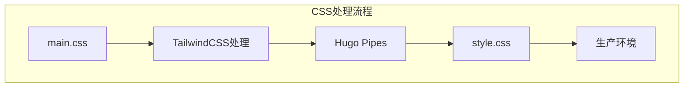
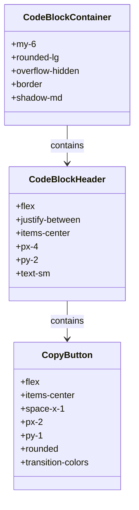
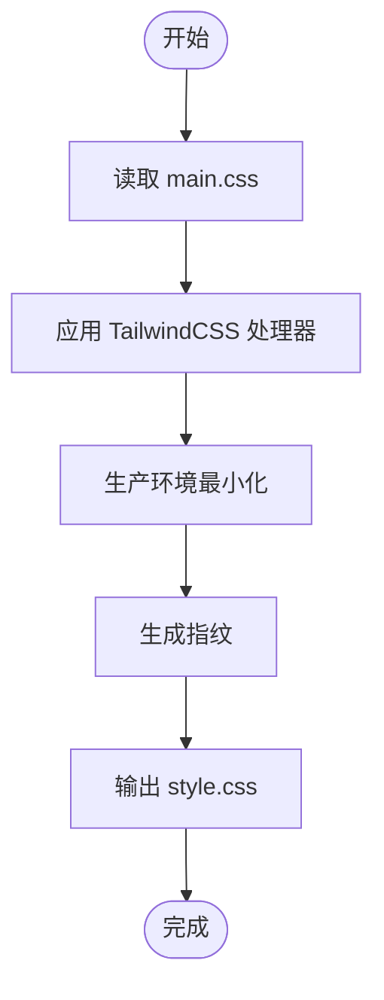

# CSS样式定制

<cite>
**本文档中引用的文件**
- [main.css](file://themes/void/assets/css/main.css)
- [style.css](file://themes/void/assets/css/style.css)
- [tailwind.config.js](file://themes/void/tailwind.config.js)
- [css.html](file://themes/void/layouts/partials/head/css.html)
</cite>

## 目录
1. [简介](#简介)
2. [项目结构分析](#项目结构分析)
3. [核心CSS文件解析](#核心css文件解析)
4. [Tailwind扩展规则详解](#tailwind扩展规则详解)
5. [Hugo Pipes处理流程](#hugo-pipes处理流程)
6. [实际自定义案例](#实际自定义案例)
7. [避免样式冲突的最佳实践](#避免样式冲突的最佳实践)
8. [调试与验证](#调试与验证)
9. [结论](#结论)

## 简介
本指南详细说明如何通过修改`main.css`和`style.css`来自定义博客的视觉表现。我们将深入探讨基于Tailwind的扩展规则，包括代码块高亮、表格边框、引用样式、脚注外观等增强设计，并展示如何添加新的CSS类或覆盖现有样式。结合Hugo Pipes机制，解释CSS文件如何被自动处理、压缩并注入到最终页面中。

## 项目结构分析
博客主题采用标准的Hugo主题结构，CSS资源位于`themes/void/assets/css/`目录下，主要包含两个核心文件：`main.css`作为源文件，`style.css`作为生成的目标文件。Hugo Pipes在构建过程中会处理这些文件。



**Diagram sources**
- [main.css](file://themes/void/assets/css/main.css)
- [style.css](file://themes/void/assets/css/style.css)

**Section sources**
- [main.css](file://themes/void/assets/css/main.css)
- [style.css](file://themes/void/assets/css/style.css)

## 核心CSS文件解析
`main.css`是主要的样式表文件，它导入了Tailwind CSS框架并通过@apply指令扩展了各种Markdown元素的样式。`style.css`是由Tailwind CLI生成的完整样式表，包含了所有可用的实用类。

### main.css结构
`main.css`文件使用了Tailwind的@import指令来引入框架，并通过@apply语法为特定选择器应用预定义的实用类。这种模式允许开发者在保持一致性的同时进行定制化。

**Section sources**
- [main.css](file://themes/void/assets/css/main.css)

### style.css生成过程
`style.css`不是手动编辑的文件，而是由Tailwind CLI根据`main.css`中的内容和配置自动生成的。这个文件包含了所有可能用到的CSS类，但通过tree-shaking技术只保留实际使用的部分。

**Section sources**
- [style.css](file://themes/void/assets/css/style.css)

## Tailwind扩展规则详解
`main.css`文件中定义了一系列针对Markdown渲染的增强样式规则，这些规则利用Tailwind的@apply语法来组合基础实用类。

### 代码块样式增强
代码块容器通过`.code-block-container`类设置了圆角、阴影和边框，确保代码区域具有良好的视觉隔离效果。头部区域包含语言标签和复制按钮，提升了用户体验。



**Diagram sources**
- [main.css](file://themes/void/assets/css/main.css#L100-L150)

### 表格样式增强
表格样式通过.prose table选择器进行了全面增强，设置了宽度、文本对齐方式和边框合并属性。表头和单元格分别应用了不同的背景色和内边距，提高了可读性。

**Section sources**
- [main.css](file://themes/void/assets/css/main.css#L20-L30)

### 引用块样式增强
引用块通过左侧蓝色边框和浅蓝色背景创建了明显的视觉区分。斜体字体和适当的内边距使其在段落中脱颖而出，同时保持优雅的外观。

**Section sources**
- [main.css](file://themes/void/assets/css/main.css#L40-L45)

### 脚注样式增强
脚注系统经过精心设计，包含返回链接、悬停效果和高亮动画。这些样式不仅提升了功能性，还增强了交互体验，使读者能够轻松地在正文和脚注之间导航。

**Section sources**
- [main.css](file://themes/void/assets/css/main.css#L70-L90)

## Hugo Pipes处理流程
Hugo Pipes是Hugo内置的资产管道系统，负责处理CSS、JavaScript和其他静态资源。在本主题中，它被用来编译和优化CSS文件。

### 处理步骤
1. 读取`main.css`源文件
2. 应用Tailwind CSS处理器
3. 根据环境进行最小化压缩
4. 生成指纹（fingerprint）用于缓存控制
5. 输出最终的CSS文件



**Diagram sources**
- [css.html](file://themes/void/layouts/partials/head/css.html)

### 配置选项
Hugo Pipes配置包括minify（最小化）和inlineImports（内联导入）选项。在生产环境中启用最小化可以显著减小文件大小，提高加载速度。

**Section sources**
- [css.html](file://themes/void/layouts/partials/head/css.html#L5-L15)

## 实际自定义案例
以下是一些常见的自定义需求及其解决方案，展示了如何通过修改CSS来实现特定的视觉效果。

### 更改段落行距
要调整段落之间的间距，可以在`main.css`中添加或修改p+p选择器的margin-top值：

```css
p + p {
  margin-top: 10px; /* 增加段落间距 */
}
```

**Section sources**
- [main.css](file://themes/void/assets/css/main.css#L180-L182)

### 调整图片圆角
图片的圆角可以通过修改.prose img选择器的border-radius值来调整：

```css
.prose img {
  @apply rounded-xl; /* 增大圆角半径 */
}
```

**Section sources**
- [main.css](file://themes/void/assets/css/main.css#L60-L65)

### 自定义滚动条样式
虽然当前主题未直接定义滚动条样式，但可以通过添加新的CSS规则来实现：

```css
/* Webkit浏览器滚动条样式 */
::-webkit-scrollbar {
  width: 8px;
}

::-webkit-scrollbar-track {
  background: #f1f1f1;
}

::-webkit-scrollbar-thumb {
  background: #c1c1c1;
  border-radius: 4px;
}
```

## 避免样式冲突的最佳实践
在自定义CSS时，遵循一些最佳实践可以帮助避免样式冲突并确保响应式布局不受影响。

### 使用命名空间
为自定义样式添加特定的前缀或类名，以避免与现有样式发生冲突。例如，使用`.custom-*`前缀来标识自定义样式。

### 优先使用Tailwind类
尽可能使用Tailwind提供的实用类而不是编写自定义CSS。这有助于保持样式的一致性和可维护性。

### 测试响应式行为
在不同屏幕尺寸下测试更改的效果，确保移动设备上的显示效果良好。可以使用浏览器开发者工具的设备模拟功能进行测试。

## 调试与验证
使用浏览器开发者工具是调试CSS样式的有效方法。通过检查元素、查看计算样式和实时编辑CSS，可以快速定位和解决问题。

### 开发者工具技巧
- 使用"Inspect Element"功能查看应用的样式
- 在Styles面板中临时禁用规则以观察效果变化
- 利用Console执行JavaScript来动态修改样式
- 使用Network面板监控CSS文件的加载情况

**Section sources**
- [main.js](file://themes/void/assets/js/main.js)

## 结论
通过理解和利用`main.css`和`style.css`的结构，结合Hugo Pipes的强大功能，您可以轻松地自定义博客的视觉表现。记住始终备份原始文件，在开发环境中测试更改，并遵循最佳实践来确保样式的一致性和兼容性。