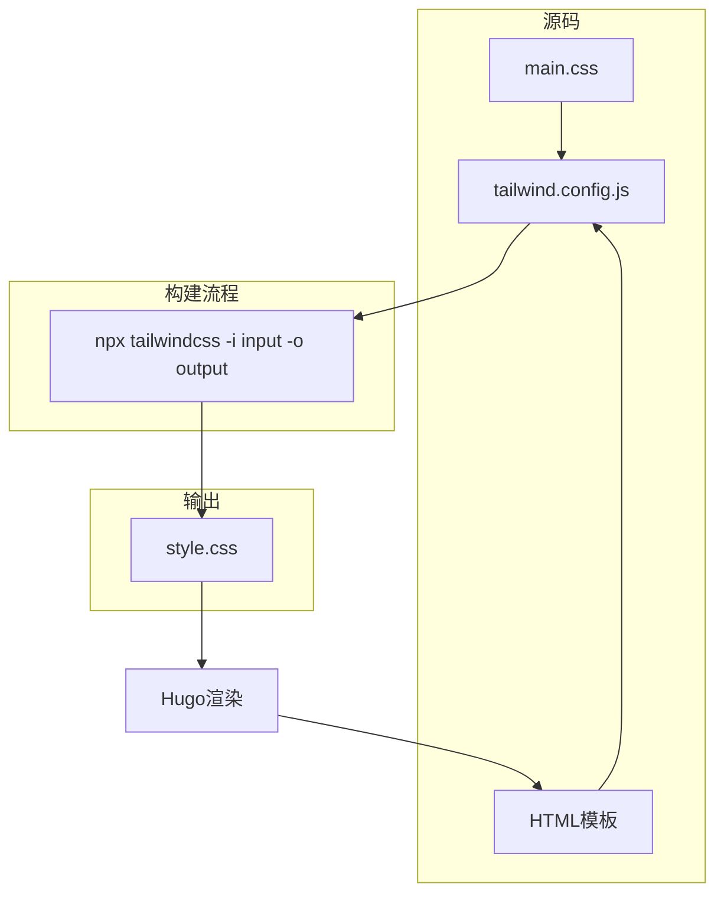
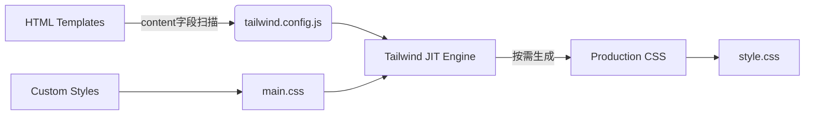
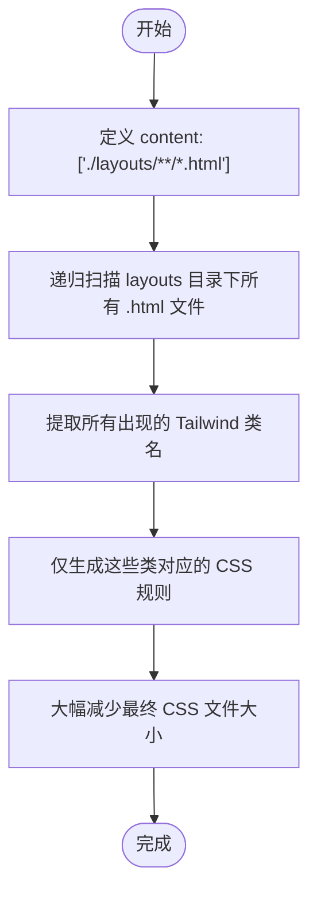
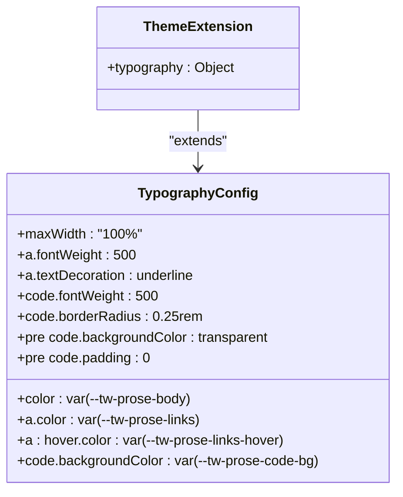

# Tailwind配置管理

<cite>
**本文档中引用的文件**  
- [tailwind.config.js](file://themes/void/tailwind.config.js)
- [main.css](file://themes/void/assets/css/main.css)
- [package.json](file://themes/void/package.json)
- [baseof.html](file://themes/void/layouts/_default/baseof.html)
- [single.html](file://themes/void/layouts/_default/single.html)
- [css.html](file://themes/void/layouts/partials/head/css.html)
</cite>

## 目录
1. [简介](#简介)
2. [项目结构](#项目结构)
3. [核心组件](#核心组件)
4. [架构概述](#架构概述)
5. [详细组件分析](#详细组件分析)
6. [依赖分析](#依赖分析)
7. [性能考虑](#性能考虑)
8. [故障排除指南](#故障排除指南)
9. [结论](#结论)

## 简介
Tailwind CSS 是一种实用优先的 CSS 框架，通过 `tailwind.config.js` 配置文件实现高度可定制化。本项目使用 Hugo 构建静态网站，并集成 Tailwind 实现现代化样式设计。该配置文件控制类名生成范围、主题扩展和插件加载，确保仅必要的样式进入生产环境。

## 项目结构
该项目采用典型的 Hugo 主题结构，其中 Tailwind 配置于 `themes/void` 目录下。CSS 样式通过 PostCSS 和 Tailwind CLI 编译处理，最终输出优化后的 `style.css` 文件。



**图示来源**
- [tailwind.config.js](file://themes/void/tailwind.config.js#L1-L38)
- [main.css](file://themes/void/assets/css/main.css#L1-L182)
- [package.json](file://themes/void/package.json#L40-L42)

**本节来源**
- [tailwind.config.js](file://themes/void/tailwind.config.js#L1-L38)
- [package.json](file://themes/void/package.json#L1-L50)

## 核心组件
`tailwind.config.js` 是 Tailwind 的核心配置文件，定义了内容扫描路径、主题扩展和插件系统。其主要作用是防止未使用的 CSS 类进入生产环境，从而显著减小最终样式表体积。

**本节来源**
- [tailwind.config.js](file://themes/void/tailwind.config.js#L1-L38)

## 架构概述
整个前端样式体系基于 Tailwind 的 JIT（即时编译）模式运行。在构建时，Tailwind 扫描所有 HTML 模板文件，提取实际使用的类名并生成对应的 CSS 规则。



**图示来源**
- [tailwind.config.js](file://themes/void/tailwind.config.js#L2)
- [main.css](file://themes/void/assets/css/main.css#L2)
- [single.html](file://themes/void/layouts/_default/single.html#L1-L82)

## 详细组件分析

### 内容扫描机制分析
Tailwind 使用 `content` 字段指定需要扫描的模板文件路径，以确定哪些类名应被保留。

#### 内容路径配置


**图示来源**
- [tailwind.config.js](file://themes/void/tailwind.config.js#L2)
- [baseof.html](file://themes/void/layouts/_default/baseof.html#L1-L24)
- [single.html](file://themes/void/layouts/_default/single.html#L1-L82)

**本节来源**
- [tailwind.config.js](file://themes/void/tailwind.config.js#L2)
- [baseof.html](file://themes/void/layouts/_default/baseof.html#L1-L24)

### 主题扩展分析
`theme.extend` 允许开发者安全地扩展默认主题，而不会覆盖原有设置。

#### Typography 插件样式扩展


**图示来源**
- [tailwind.config.js](file://themes/void/tailwind.config.js#L5-L35)
- [main.css](file://themes/void/assets/css/main.css#L1-L182)

**本节来源**
- [tailwind.config.js](file://themes/void/tailwind.config.js#L5-L35)

## 依赖分析
项目通过 npm 管理 Tailwind 及其相关工具链依赖，确保构建过程稳定可靠。

```mermaid
graph TD
A[tailwind.config.js] --> B[tailwindcss]
A --> C[@tailwindcss/typography]
D[package.json] --> B
D --> C
E[build script] --> F[npx tailwindcss -i main.css -o style.css]
F --> B
```

**图示来源**
- [tailwind.config.js](file://themes/void/tailwind.config.js#L37)
- [package.json](file://themes/void/package.json#L2-L6)
- [package.json](file://themes/void/package.json#L40-L42)

**本节来源**
- [tailwind.config.js](file://themes/void/tailwind.config.js#L37)
- [package.json](file://themes/void/package.json#L1-L50)

## 性能考虑
Tailwind 的按需构建机制对性能优化至关重要：
- **减少文件体积**：只包含实际使用的类，避免冗余样式
- **提升加载速度**：更小的 CSS 文件意味着更快的下载和解析时间
- **改善用户体验**：页面渲染更迅速，FOUC（无样式内容闪烁）风险降低

错误的 `content` 配置可能导致样式丢失，例如遗漏某些模板路径会使对应类名不被识别，从而无法生成相应样式规则。

## 故障排除指南
当遇到样式缺失问题时，请检查以下方面：

**本节来源**
- [tailwind.config.js](file://themes/void/tailwind.config.js#L2)
- [css.html](file://themes/void/layouts/partials/head/css.html#L1-L43)

## 结论
`tailwind.config.js` 在现代前端工程中扮演着关键角色，它不仅控制样式生成范围，还支持深度自定义。正确配置 `content` 字段可确保生产环境的高效性，而 `theme.extend` 提供了灵活的主题定制能力。建议始终在项目根目录创建自定义配置以覆盖默认设置，并定期验证构建结果以防止意外样式丢失。