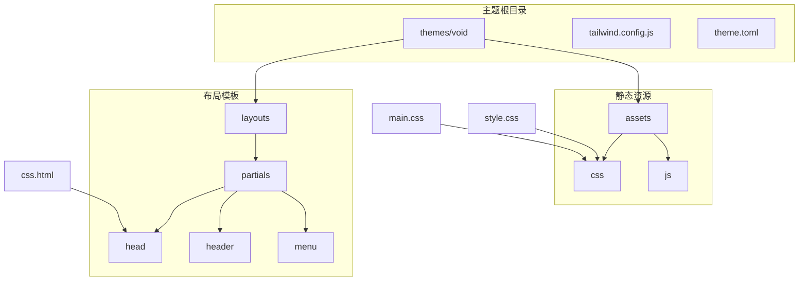
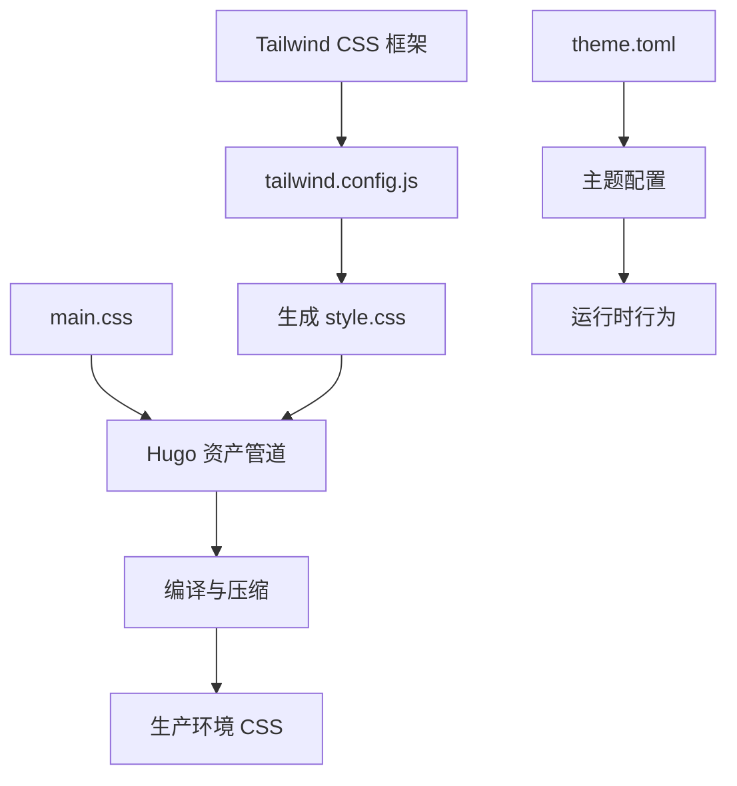
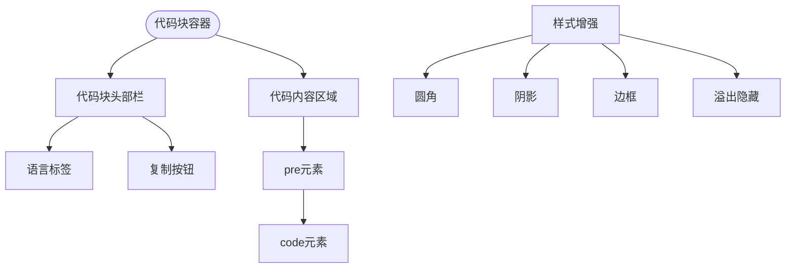
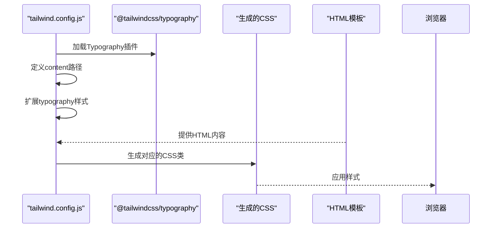
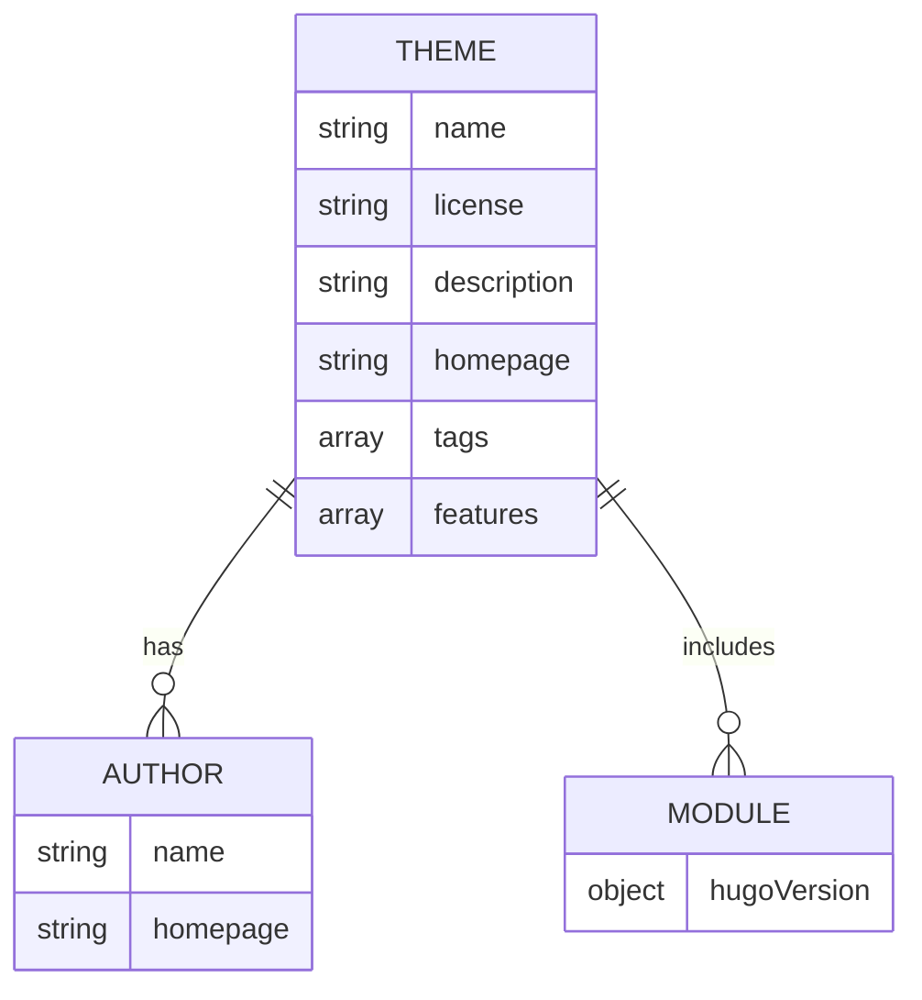
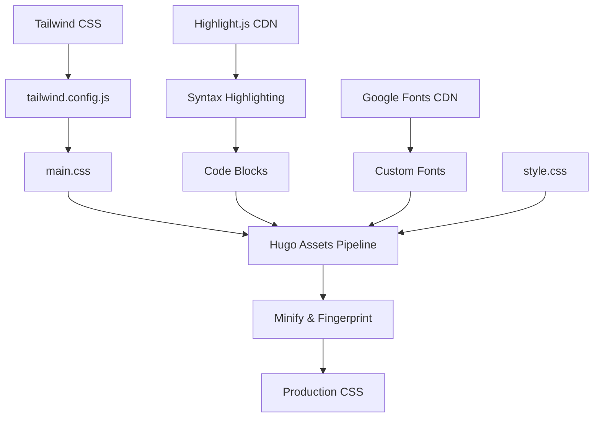

# 主题与样式定制

<cite>
**本文档中引用的文件**
- [main.css](file://themes/void/assets/css/main.css)
- [tailwind.config.js](file://themes/void/tailwind.config.js)
- [style.css](file://themes/void/assets/css/style.css)
- [css.html](file://themes/void/layouts/partials/head/css.html)
- [head.html](file://themes/void/layouts/partials/head.html)
- [theme.toml](file://themes/void/theme.toml)
</cite>

## 目录
1. [简介](#简介)
2. [项目结构](#项目结构)
3. [核心组件](#核心组件)
4. [架构概述](#架构概述)
5. [详细组件分析](#详细组件分析)
6. [依赖分析](#依赖分析)
7. [性能考虑](#性能考虑)
8. [故障排除指南](#故障排除指南)
9. [结论](#结论)

## 简介
本文档系统讲解如何通过Hugo主题"Void"进行外观与视觉风格的定制。重点介绍Tailwind CSS在`main.css`中的扩展应用，`tailwind.config.js`对类名生成的控制机制，以及`theme.toml`中的可配置参数。同时说明Hugo资产管道如何处理CSS编译与压缩，确保网站性能不受影响。

## 项目结构
主题"Void"采用标准的Hugo主题目录结构，将静态资源、布局模板和配置文件组织在清晰的目录层级中。核心样式文件位于`assets/css/`目录下，配置文件集中于主题根目录。



**Diagram sources**
- [main.css](file://themes/void/assets/css/main.css)
- [tailwind.config.js](file://themes/void/tailwind.config.js)
- [theme.toml](file://themes/void/theme.toml)
- [css.html](file://themes/void/layouts/partials/head/css.html)

**Section sources**
- [main.css](file://themes/void/assets/css/main.css)
- [tailwind.config.js](file://themes/void/tailwind.config.js)
- [theme.toml](file://themes/void/theme.toml)

## 核心组件
文档的核心组件包括`main.css`中的Tailwind扩展规则、`tailwind.config.js`中的配置选项以及`theme.toml`中的主题参数。这些文件共同构成了主题的样式体系，允许用户灵活定制网站外观。

**Section sources**
- [main.css](file://themes/void/assets/css/main.css#L0-L182)
- [tailwind.config.js](file://themes/void/tailwind.config.js#L0-L39)
- [theme.toml](file://themes/void/theme.toml#L0-L27)

## 架构概述
主题采用分层的CSS架构，结合Hugo的资产管道实现高效的样式管理和优化。Tailwind CSS作为基础框架，通过配置文件控制生成的类名，而自定义CSS文件则用于扩展和覆盖默认样式。



**Diagram sources**
- [tailwind.config.js](file://themes/void/tailwind.config.js#L0-L39)
- [main.css](file://themes/void/assets/css/main.css#L0-L182)
- [css.html](file://themes/void/layouts/partials/head/css.html#L0-L43)

## 详细组件分析

### main.css 样式扩展分析
`main.css`文件通过@apply指令扩展了Tailwind的实用类，增强了排版、代码块和表格的视觉效果。文件还引入了Google Fonts，并使用@theme定义了双语字体变量。

#### 排版样式增强
```mermaid
classDiagram
class Typography {
+maxWidth : "100%"
+color : "var(--tw-prose-body)"
+a : { color, textDecoration, fontWeight }
+code : { fontWeight, backgroundColor, padding, borderRadius }
+blockquote : { borderLeft, backgroundColor, paddingLeft, italic }
}
Typography --> LinkStyling : "extends"
Typography --> CodeStyling : "extends"
Typography --> BlockquoteStyling : "extends"
```

**Diagram sources**
- [main.css](file://themes/void/assets/css/main.css#L10-L170)
- [tailwind.config.js](file://themes/void/tailwind.config.js#L5-L35)

#### 代码块样式增强


**Diagram sources**
- [main.css](file://themes/void/assets/css/main.css#L120-L170)

### tailwind.config.js 配置分析
该配置文件通过extend属性扩展了Typography插件的默认样式，利用CSS变量实现了主题化支持。content字段指定了需要扫描的HTML文件路径，确保相关类名被正确生成。



**Diagram sources**
- [tailwind.config.js](file://themes/void/tailwind.config.js#L1-L39)

### theme.toml 配置分析
`theme.toml`文件包含了主题的元数据信息，如名称、许可证、描述和功能标签。虽然当前版本未包含可配置的主题参数，但其结构为未来扩展提供了基础。



**Diagram sources**
- [theme.toml](file://themes/void/theme.toml#L1-L27)

## 依赖分析
主题的样式系统依赖于多个组件的协同工作，包括Tailwind CSS框架、Hugo资产管道和外部CDN服务。



**Diagram sources**
- [tailwind.config.js](file://themes/void/tailwind.config.js#L1-L39)
- [main.css](file://themes/void/assets/css/main.css#L1-L182)
- [css.html](file://themes/void/layouts/partials/head/css.html#L1-L43)

**Section sources**
- [tailwind.config.js](file://themes/void/tailwind.config.js#L1-L39)
- [main.css](file://themes/void/assets/css/main.css#L1-L182)
- [css.html](file://themes/void/layouts/partials/head/css.html#L1-L43)

## 性能考虑
Hugo资产管道通过多种机制确保样式性能：在生产环境中自动启用CSS压缩，使用fingerprinting实现缓存优化，并通过defer加载策略优化关键渲染路径。

**Section sources**
- [css.html](file://themes/void/layouts/partials/head/css.html#L1-L43)

## 故障排除指南
当遇到样式问题时，应检查配置文件的语法正确性，验证资产管道的处理流程，并确认CDN资源的可用性。

**Section sources**
- [tailwind.config.js](file://themes/void/tailwind.config.js#L1-L39)
- [css.html](file://themes/void/layouts/partials/head/css.html#L1-L43)

## 结论
通过合理配置`tailwind.config.js`和`main.css`，用户可以灵活定制网站的外观风格，同时保持良好的性能表现。建议遵循文档指导进行修改，以确保样式的稳定性和一致性。