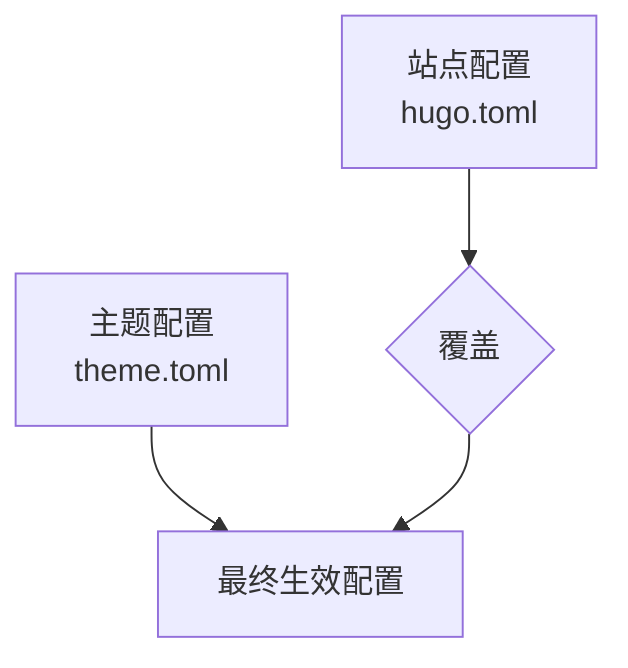
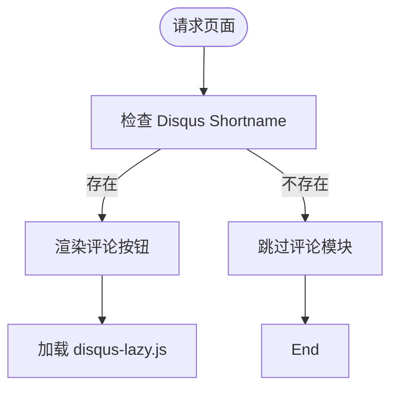

# 主题参数配置

<cite>
**本文档中引用的文件**
- [theme.toml](file://themes/void/theme.toml)
- [hugo.toml](file://hugo.toml)
- [head.html](file://themes/void/layouts/partials/head.html)
- [css.html](file://themes/void/layouts/partials/head/css.html)
- [disqus_lazy.html](file://themes/void/layouts/partials/disqus_lazy.html)
- [footer.html](file://themes/void/layouts/partials/footer.html)
</cite>

## 目录
1. [简介](#简介)
2. [主题配置文件结构](#主题配置文件结构)
3. [核心可配置参数详解](#核心可配置参数详解)
4. [条件渲染逻辑在模板中的实现](#条件渲染逻辑在模板中的实现)
5. [操作指南：常见自定义设置](#操作指南：常见自定义设置)
6. [配置优先级机制](#配置优先级机制)
7. [总结](#总结)

## 简介
本文档系统讲解 Hugo 主题 `void` 中可通过 `theme.toml` 和站点级 `hugo.toml` 配置的主题参数，重点分析颜色模式、字体选择、统计与评论功能等核心选项。同时说明这些参数如何在 `layouts` 与 `partials` 模板中通过条件渲染影响前端展示，并提供实用的操作指南。

## 主题配置文件结构

Hugo 主题的配置以模块化方式组织，主要依赖两个配置文件：

- **`theme.toml`**：主题级别的默认配置，定义了主题的基本信息和默认行为。
- **`hugo.toml`**（或 `config.toml`）：站点级别的配置文件，可覆盖主题默认设置，实现个性化定制。

当前项目中，`theme.toml` 主要包含主题元数据（如名称、许可证、作者），而实际前端行为控制由站点配置 `hugo.toml` 及其扩展参数驱动。



**Diagram sources**
- [theme.toml](file://themes/void/theme.toml)
- [hugo.toml](file://hugo.toml)

**Section sources**
- [theme.toml](file://themes/void/theme.toml#L1-L28)
- [hugo.toml](file://hugo.toml#L1-L28)

## 核心可配置参数详解

尽管 `theme.toml` 本身未直接暴露前端样式参数，但该主题支持通过 `hugo.toml` 的 `[params]` 区块进行深度定制。以下是关键可配置项及其对前端的影响：

### 颜色模式（light/dark/auto）
主题支持浅色、深色及自动模式切换。虽然当前配置中未显式声明 `colorMode` 参数，但可通过自定义 CSS 类或 JavaScript 检测 `prefers-color-scheme` 实现暗黑模式。若需默认启用暗黑模式，可在全局样式中强制设置 `dark` 类。

### 字体选择（系统字体或 Google Fonts）
主题已在 `head.html` 和 `css.html` 中预加载 Google Fonts：
- 英文：Roboto
- 中文：Noto Sans SC

此配置为静态引入，若需更换字体，可通过覆盖 CSS 变量或修改 `resources.Get "css/style.css"` 的源文件实现。

### 不蒜子统计（Busuanzi）
不蒜子访问统计已集成于 `footer.html` 中，通过以下代码片段实现：
```html
<span id="busuanzi_container_site_pv" style="display: none;">总访问量: <span id="busuanzi_value_site_pv"></span></span>
<script async src="//busuanzi.ibruce.info/busuanzi/2.3/busuanzi.pure.mini.js"></script>
```
该功能默认启用，无需额外配置即可显示访问数据。

### Disqus 评论系统
Disqus 评论通过 `disqus_lazy.html` 实现懒加载。其开关由 Hugo 内置服务配置控制：
```toml
[services.disqus]
  shortname = "your-disqus-shortname"
```
当 `shortname` 存在时，评论区域将被渲染；否则整个模块不会出现在页面中。

**Section sources**
- [head.html](file://themes/void/layouts/partials/head.html#L1-L17)
- [css.html](file://themes/void/layouts/partials/head/css.html#L1-L44)
- [disqus_lazy.html](file://themes/void/layouts/partials/disqus_lazy.html#L1-L37)
- [footer.html](file://themes/void/layouts/partials/footer.html#L1-L96)

## 条件渲染逻辑在模板中的实现

主题使用 Hugo 模板语言中的条件判断（`{{ if }}`, `{{ with }}`）实现动态内容渲染。

### Disqus 评论的条件加载
```go
{{ $disqusShortname := site.Config.Services.Disqus.Shortname }}
{{ if $disqusShortname }}
  <!-- 渲染 Disqus 容器 -->
{{ end }}
```
仅当站点配置中设置了 Disqus shortname 时，才会生成评论相关 HTML 与 JS。

### 社交链接的按需显示
在 `footer.html` 中，社交图标使用 `{{ with .Site.Params.social.github }}` 判断是否应渲染 GitHub 图标，确保仅在配置存在时显示对应链接。

### 多语言菜单文本支持
通过 `{{ with T . }}` 调用 i18n 翻译函数，实现菜单项的国际化支持，适配不同语言环境。



**Diagram sources**
- [disqus_lazy.html](file://themes/void/layouts/partials/disqus_lazy.html#L1-L37)

**Section sources**
- [disqus_lazy.html](file://themes/void/layouts/partials/disqus_lazy.html#L1-L37)
- [footer.html](file://themes/void/layouts/partials/footer.html#L1-L96)

## 操作指南：常见自定义设置

### 如何开启暗黑模式默认启用
目前主题未提供原生暗黑模式切换，但可通过以下方式强制启用：
1. 在自定义 CSS 文件中添加：
   ```css
   html { filter: invert(1) hue-rotate(180deg); }
   ```
2. 或修改 `style.css`，设置默认 `dark` 类并调整 Tailwind 配置。

### 更换主色调变量
主题基于 Tailwind CSS 构建，主色调由 `tailwind.config.js` 定义。修改步骤如下：
1. 打开 `themes/void/tailwind.config.js`
2. 更新 `theme.colors.primary` 值为所需颜色（如 `#ff6b6b`）
3. 重新构建 CSS 资源

### 隐藏特定 UI 元素
#### 隐藏阅读时间
若主题输出阅读时间，通常位于 `single.html` 或 `list.html`，查找类似 `{{ .ReadingTime }}` 并删除或包裹在 `{{ if not .Site.Params.hideReadingTime }}` 条件中。

#### 隐藏标签（Tags）
在列表或文章页模板中移除 `{{ range .Params.tags }}` 循环即可隐藏标签显示。

**Section sources**
- [tailwind.config.js](file://themes/void/tailwind.config.js)
- [single.html](file://themes/void/layouts/_default/single.html)
- [list.html](file://themes/void/layouts/_default/list.html)

## 配置优先级机制

Hugo 遵循明确的配置覆盖规则：

1. **站点配置 > 主题配置**  
   `hugo.toml` 中的 `[params]` 可完全覆盖 `theme.toml` 中同名参数。
2. **页面 Front Matter > 站点配置**  
   单个页面可通过 YAML 头部覆盖全局设置。
3. **运行时环境变量 > 所有文件配置**  
   使用 `HUGO_PARAMS_*` 环境变量可动态注入配置。

例如，在 `hugo.toml` 中设置：
```toml
[params]
  showReadingTime = false
```
即可全局关闭阅读时间显示，即使主题默认开启。

**Section sources**
- [hugo.toml](file://hugo.toml#L1-L28)

## 总结

`void` 主题通过简洁的配置结构实现了高度可定制性。开发者可通过 `hugo.toml` 覆盖主题默认行为，利用条件渲染控制 UI 显示，并结合 Tailwind CSS 快速调整视觉风格。理解配置优先级是实现灵活定制的关键。未来建议在 `theme.toml` 中显式暴露更多前端参数（如 `colorMode`, `fontFamily`），以提升易用性。