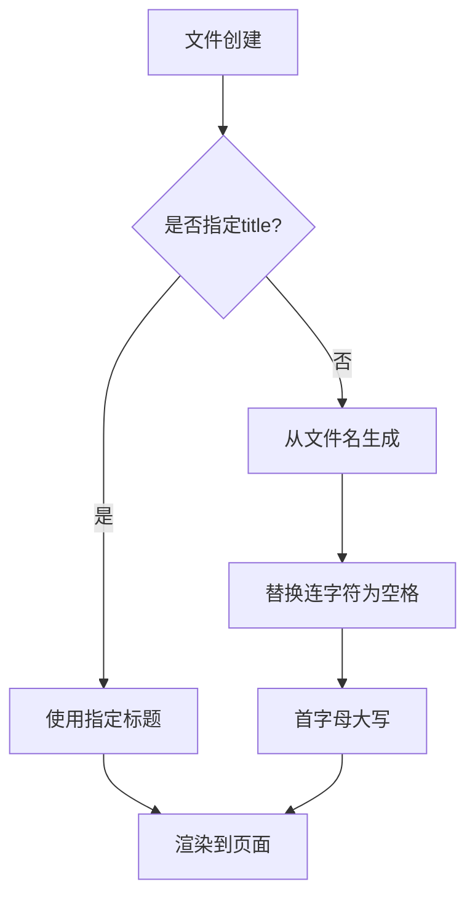
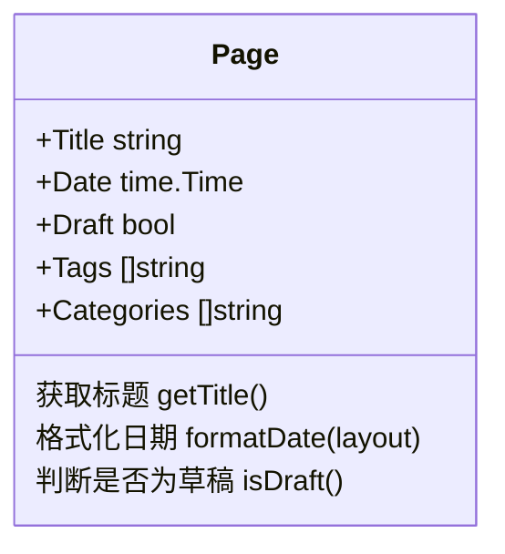
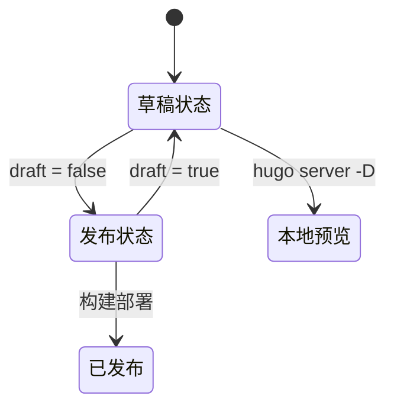
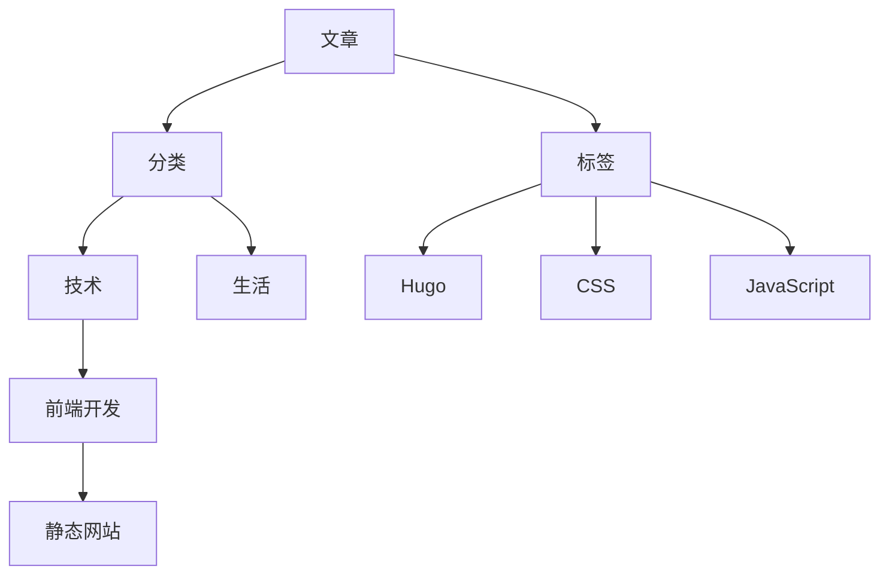

# Front Matter 配置

<cite>
**本文档引用文件**
- [my-first-post.md](file://content/posts/my-first-post.md)
- [default.md](file://archetypes/default.md)
- [default.md](file://themes/void/archetypes/default.md)
- [hugo.toml](file://hugo.toml)
</cite>

## 目录
1. [简介](#简介)
2. [Front Matter 基础语法](#front-matter-基础语法)
3. 核心字段详解
   - [title 字段](#title-字段)
   - [date 字段](#date-字段)
   - [draft 字段](#draft-字段)
4. 分类与标签配置
   - [tags 字段](#tags-字段)
   - [categories 字段](#categories-字段)
5. [默认模板与自定义设置](#默认模板与自定义设置)
6. [特殊内容类型的扩展字段](#特殊内容类型的扩展字段)
7. [常见错误排查](#常见错误排查)
8. [最佳实践建议](#最佳实践建议)

## 简介
Front Matter 是 Hugo 中用于定义页面元数据的关键组成部分，位于内容文件的开头，使用 TOML、YAML 或 JSON 格式编写。它控制着文章标题、发布时间、草稿状态以及分类信息等关键属性，直接影响内容的渲染方式和站点结构。

**本节不涉及具体源码分析，无需标注来源**

## Front Matter 基础语法
Hugo 支持多种格式的 Front Matter，其中 TOML 使用 `+++` 作为定界符，适用于大多数中文博客场景。每个键值对以 `key = "value"` 的形式书写，支持字符串、布尔值、数组等多种数据类型。

```toml
+++
title = "文章标题"
date = 2024-01-14T07:07:07+01:00
draft = false
tags = ["前端", "Hugo"]
categories = ["技术"]
+++
```

**Section sources**
- [my-first-post.md](file://content/posts/my-first-post.md#L0-L9)

### TOML 语法特点
- 使用双引号包裹字符串
- 时间戳遵循 RFC 3339 标准格式
- 布尔值使用 `true` / `false`
- 数组使用方括号 `[ ]` 包裹元素

## 核心字段详解

### title 字段
`title` 字段定义文章在页面上显示的主标题，是 SEO 优化的重要组成部分。该字段会被用于生成页面 `<title>` 标签，并在列表页、归档页中展示。

当未显式设置时，Hugo 会根据文件名通过模板自动填充。例如 `my-first-post.md` 将被转换为 "My First Post"。



**Diagram sources**
- [default.md](file://archetypes/default.md#L3)
- [default.md](file://themes/void/archetypes/default.md#L1)

**Section sources**
- [my-first-post.md](file://content/posts/my-first-post.md#L1)
- [default.md](file://archetypes/default.md#L3)

### date 字段
`date` 字段决定文章的发布日期和排序依据。必须采用 ISO 8601 扩展格式（RFC 3339），如 `2024-01-14T07:07:07+01:00`。此时间将影响文章在列表页中的排列顺序，并用于生成“年份归档”视图。

主题模板通常调用 `.Date.Format "2006-01-02"` 进行格式化输出。



**Diagram sources**
- [my-first-post.md](file://content/posts/my-first-post.md#L2)
- [default.md](file://archetypes/default.md#L1)

**Section sources**
- [my-first-post.md](file://content/posts/my-first-post.md#L2)
- [hugo.toml](file://hugo.toml#L1)

### draft 字段
`draft = true` 表示该文章处于草稿状态，在生产环境构建时不会被发布。仅在本地开发模式下（`hugo server -D`）可见。这是管理未完成内容的有效机制。

一旦设置为 `false`，文章将在下次构建时正常发布。



**Diagram sources**
- [my-first-post.md](file://content/posts/my-first-post.md#L3)
- [default.md](file://archetypes/default.md#L2)

**Section sources**
- [my-first-post.md](file://content/posts/my-first-post.md#L3)
- [default.md](file://archetypes/default.md#L2)

## 分类与标签配置

### tags 字段
`tags` 是一个字符串数组，用于为文章添加关键词标签。这些标签可用于聚合相关内容，在 `/tags` 页面中生成标签云或列表视图。用户点击标签可查看所有相关文章。

正确用法：
```toml
tags = ["Hugo", "静态网站", "前端"]
```

错误示例（含空格）：
```toml
tags = ["前端 开发"] # 应避免空格
```

**Section sources**
- [my-first-post.md](file://content/posts/my-first-post.md#L1-L9)

### categories 字段
`categories` 定义文章所属的主要分类，通常比标签更具结构性。一个文章可属于多个分类，但建议保持层级清晰。分类常用于导航菜单或侧边栏组织内容。

与标签不同，分类更强调内容归属关系而非关键词提取。



**Diagram sources**
- [default.md](file://archetypes/default.md)
- [hugo.toml](file://hugo.toml)

**Section sources**
- [my-first-post.md](file://content/posts/my-first-post.md)

## 默认模板与自定义设置
Hugo 使用 `archetypes/default.md` 文件作为新内容的默认 Front Matter 模板。项目根目录下的 archetype 优先级高于主题内置模板。

当前项目结构中存在两个默认模板：
- 项目级：`archetypes/default.md`
- 主题级：`themes/void/archetypes/default.md`

两者均设置了动态生成标题和日期的模板语法 `{{ .Date }}` 和 `{{ replace .File.ContentBaseName "-" " " | title }}`。

**Section sources**
- [default.md](file://archetypes/default.md#L0-L5)
- [default.md](file://themes/void/archetypes/default.md#L0-L5)

## 特殊内容类型的扩展字段
除标准字段外，某些内容类型可能需要额外元数据：
- 博客文章：`readingTime`、`lastmod`
- 项目展示：`repo`、`demo`、`image`
- 作者介绍：`author`、`avatar`

这些字段需在主题模板中预先支持才能生效。可通过修改 `single.html` 或 `_default/baseof.html` 来扩展功能。

**本节不涉及具体源码分析，无需标注来源**

## 常见错误排查
### 日期格式错误
错误格式如 `2024/01/14` 或 `Jan 14, 2024` 会导致排序异常或解析失败。务必使用完整时间戳格式。

### 标签未生效
原因可能包括：
- 标签名包含空格导致解析错误
- 主题未启用标签功能
- 缓存未清除，重建站点前运行 `hugo --gc --minify`

### 草稿文章无法预览
确保启动命令包含 `-D` 参数：`hugo server -D`

**Section sources**
- [my-first-post.md](file://content/posts/my-first-post.md)
- [default.md](file://archetypes/default.md)

## 最佳实践建议
1. **使用明确的时间戳**：始终填写完整的 RFC 3339 时间格式
2. **避免标签空格**：使用连字符连接多词标签，如 `"machine-learning"`
3. **合理规划分类层级**：不超过两级分类，保持结构清晰
4. **统一命名规范**：全站采用一致的大小写和语言风格
5. **定期审查元数据**：确保标签不过度碎片化

**本节不涉及具体源码分析，无需标注来源**