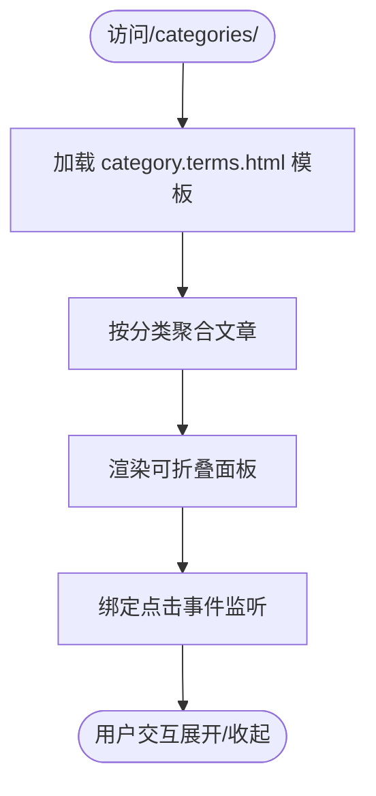
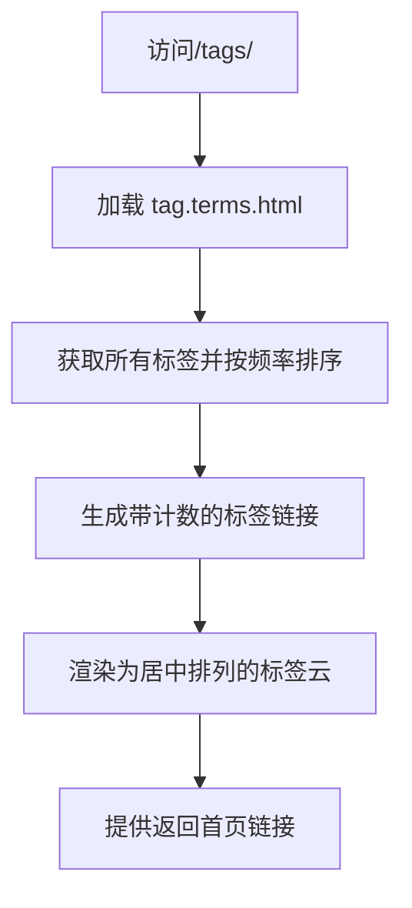

# 内容管理

<cite>
**本文档引用的文件**
- [my-first-post.md](file://content/posts/my-first-post.md)
- [default.md](file://archetypes/default.md)
- [default.md](file://themes/void/archetypes/default.md)
- [hugo.toml](file://hugo.toml)
- [single.html](file://themes/void/layouts/_default/single.html)
- [list.html](file://themes/void/layouts/_default/list.html)
- [category.terms.html](file://themes/void/layouts/taxonomy/category.terms.html)
- [tag.terms.html](file://themes/void/layouts/taxonomy/tag.terms.html)
- [tag.html](file://themes/void/layouts/taxonomy/tag.html)
- [terms.html](file://themes/void/layouts/partials/terms.html)
</cite>

## 目录
1. [简介](#简介)
2. [Front Matter 元数据详解](#front-matter-元数据详解)
3. [默认模板 archetypes/default.md](#默认模板-archetypesdefaultmd)
4. [创建新文章流程](#创建新文章流程)
5. [分类与标签系统](#分类与标签系统)
6. [归档页面展示逻辑](#归档页面展示逻辑)
7. [最佳实践建议](#最佳实践建议)

## 简介
本指南详细说明如何使用 Markdown 撰写和管理博客文章，涵盖从元数据配置到内容组织的完整工作流。基于 Hugo 静态站点生成器架构，重点介绍 `content/posts/` 目录下的文章管理机制、front matter 元信息语法、分类标签体系及自动化模板功能。

## Front Matter 元数据详解
Markdown 文件头部的 front matter 区域（以 `+++` 或 `---` 包围）用于定义文章元数据。支持以下核心字段：

- **title**: 文章标题，显示于页面头部和列表视图
- **date**: 发布时间，格式为 ISO 8601（如 `2024-01-14T07:07:07+01:00`），影响排序和归档
- **draft**: 布尔值，标记是否为草稿状态（`true` 表示不发布）
- **categories**: 分类数组，用于组织内容层级
- **tags**: 标签数组，实现多维内容关联

以 `my-first-post.md` 为例：
```markdown
+++
title = 'My First Post'
date = 2024-01-14T07:07:07+01:00
draft = false
+++
```

该配置定义了一篇已发布的文章，标题为 "My First Post"，发布时间明确，无分类与标签。

**Section sources**
- [my-first-post.md](file://content/posts/my-first-post.md#L0-L9)

## 默认模板 archetypes/default.md
Hugo 使用 `archetypes/default.md` 作为新建内容的默认模板。项目根目录下的 archetype 优先级高于主题内定义。

当前项目的自定义模板位于 `archetypes/default.md`：
```toml
+++
date = '{{ .Date }}'
draft = true
title = '{{ replace .File.ContentBaseName "-" " " | title }}'
+++
```

其作用包括：
- 自动填充当前日期
- 初始状态设为草稿（`draft = true`）
- 标题由文件名推导：将文件名中的连字符 `-` 替换为空格，并首字母大写

例如，创建文件 `my-second-post.md` 时，Hugo 将自动填充标题为 `"My Second Post"`。

若未提供自定义 archetype，则使用主题内置模板 `themes/void/archetypes/default.md`，两者结构相似但字段顺序不同。

**Section sources**
- [default.md](file://archetypes/default.md#L0-L5)
- [default.md](file://themes/void/archetypes/default.md#L0-L5)

## 创建新文章流程
遵循以下步骤添加新文章：

1. **命名规范**：在 `content/posts/` 目录下创建 `.md` 文件，推荐使用小写字母和连字符分隔单词（如 `introduction-to-hugo.md`）

2. **初始化内容**：执行 `hugo new posts/article-title.md` 命令，Hugo 将自动：
   - 读取 `archetypes/default.md` 模板
   - 生成包含预设 front matter 的文件
   - 设置 `draft = true`

3. **编辑内容**：打开生成的文件，填写标题、调整发布时间、撰写正文并保存

4. **发布文章**：将 `draft` 改为 `false` 后，构建系统会将其纳入输出

**Section sources**
- [default.md](file://archetypes/default.md#L0-L5)

## 分类与标签系统
分类（category）与标签（tag）是两种不同的内容组织方式：

| 特性 | 分类 (Category) | 标签 (Tag) |
|------|------------------|-----------|
| 层级性 | 强，通常单选或少量 | 弱，可多选 |
| 结构 | 树状，有主次之分 | 扁平，平等关系 |
| 使用场景 | 主题领域划分（如“技术”、“生活”） | 细粒度关键词标注（如“Hugo”、“Markdown”） |

在 front matter 中通过数组形式声明：
```toml
categories = ["技术"]
tags = ["Hugo", "静态网站"]
```

前端模板通过 `.Params.categories` 和 `.Params.tags` 访问这些值，并渲染为可点击链接。

**Section sources**
- [single.html](file://themes/void/layouts/_default/single.html#L15-L25)
- [list.html](file://themes/void/layouts/_default/list.html#L40-L51)

## 归档页面展示逻辑
分类与标签的归档页面分别由特定布局模板控制：

### 分类归档页 (`category.terms.html`)
- 路径：`/categories/`
- 功能：列出所有分类及其文章数量
- 交互：支持折叠/展开各分类下的文章列表
- 显示：每篇文章显示标题与发布日期
- 实现：利用 Hugo 的 `.Data.Terms.Alphabetical` 对分类进行字母排序，并绑定 JavaScript 实现手风琴效果



**Diagram sources**
- [category.terms.html](file://themes/void/layouts/taxonomy/category.terms.html#L0-L87)

### 标签归档页 (`tag.terms.html`)
- 路径：`/tags/`
- 功能：展示标签云（Tag Cloud），按使用频率排序
- 视觉：高频标签突出显示，配有计数徽章
- 导航：点击标签跳转至对应文章集合



**Diagram sources**
- [tag.terms.html](file://themes/void/layouts/taxonomy/tag.terms.html#L0-L35)

### 单个标签详情页 (`tag.html`)
- 路径：`/tags/tag-name/`
- 功能：展示某标签下的全部文章
- 结构：按年份分组，逆序排列文章
- 元素：包含标题、摘要、发布时间、相关标签
- 分页：支持分页导航（上一页/下一页）

```mermaid
flowchart TD
G[访问/tags/hugo/] --> H[加载 tag.html 模板]
H --> I[筛选带有"hugo"标签的文章]
I --> J[按年份分组并倒序]
J --> K[逐条渲染文章卡片]
K --> L[显示阅读更多链接]
L --> M[底部添加分页控件]
```

**Diagram sources**
- [tag.html](file://themes/void/layouts/taxonomy/tag.html#L0-L118)

## 最佳实践建议
为确保内容质量和维护效率，请遵循以下规范：

### 标题规范
- 使用有意义且完整的短语
- 避免特殊字符，优先使用英文字母和数字
- 文件名与标题保持语义一致（可通过 archetype 自动转换）

### 摘要写法
- 在正文中使用 `<!--more-->` 分割符手动指定摘要范围
- 或依赖系统自动截取前 140 字符（经 `truncate 140` 处理）
- 保证首段简洁明了，适合作为列表预览

### 图片引用路径处理
- 推荐将图片置于与 `.md` 文件同目录的 `images/` 子目录中
- 使用相对路径引用：``
- 可结合 Hugo 资源管道进行优化处理

### 其他建议
- 草稿阶段保持 `draft = true`，避免误发布
- 合理使用分类控制内容广度，避免过多层级
- 标签应具体、标准化，便于后期检索与聚合
- 定期检查链接有效性，尤其是外部资源

**Section sources**
- [single.html](file://themes/void/layouts/_default/single.html#L55-L81)
- [tag.html](file://themes/void/layouts/taxonomy/tag.html#L60-L70)
- [terms.html](file://themes/void/layouts/partials/terms.html#L0-L28)