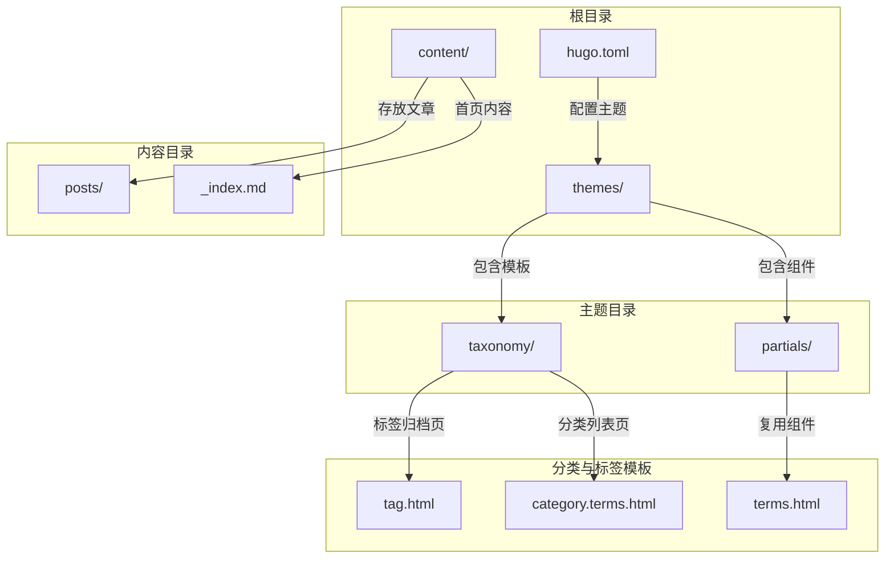
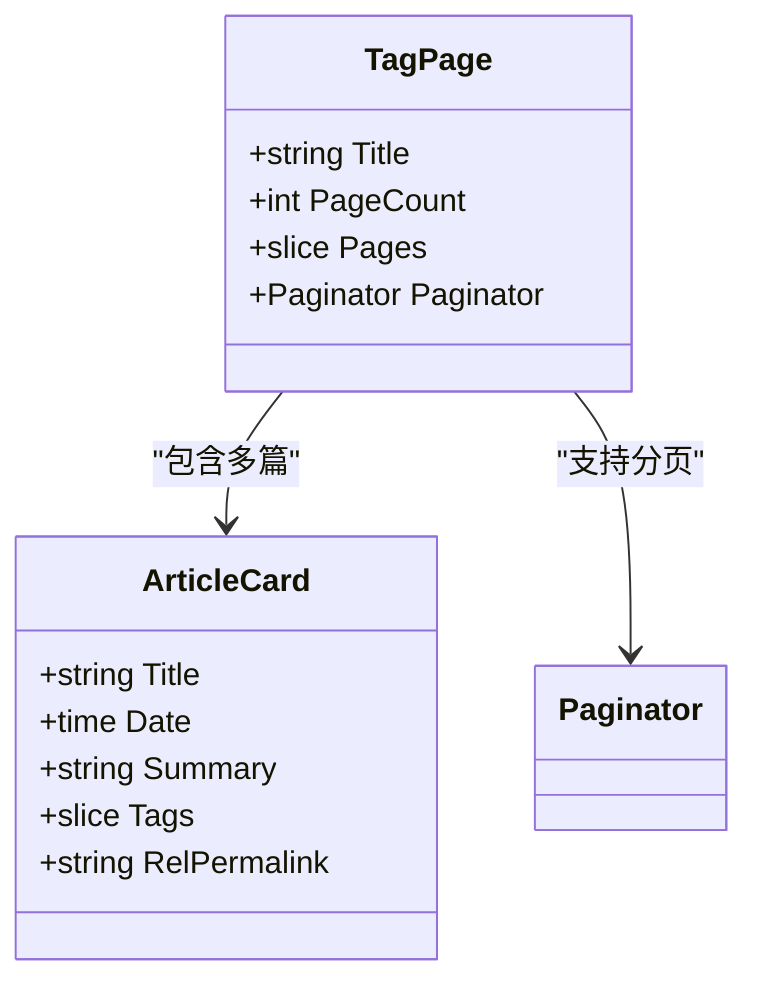
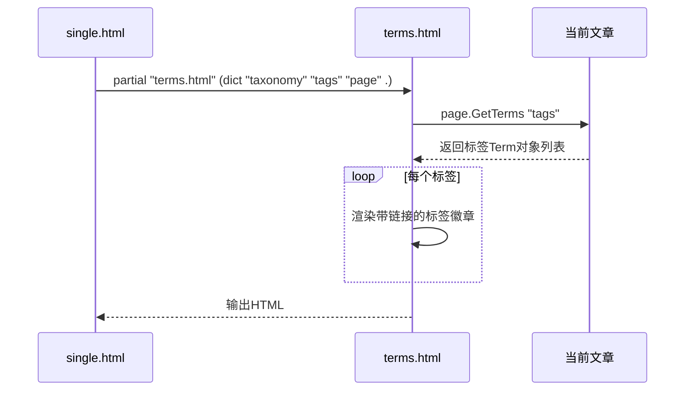
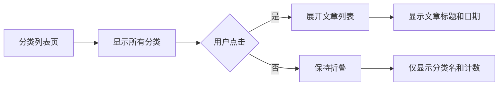

# 分类与标签管理

<cite>
**本文档中引用的文件**
- [my-first-post.md](file://content/posts/my-first-post.md)
- [tag.html](file://themes/void/layouts/taxonomy/tag.html)
- [category.terms.html](file://themes/void/layouts/taxonomy/category.terms.html)
- [terms.html](file://themes/void/layouts/partials/terms.html)
- [single.html](file://themes/void/layouts/_default/single.html)
- [hugo.toml](file://hugo.toml)
</cite>

## 目录
1. [简介](#简介)
2. [项目结构](#项目结构)
3. [核心组件](#核心组件)
4. [架构概述](#架构概述)
5. [详细组件分析](#详细组件分析)
6. [依赖分析](#依赖分析)
7. [性能考虑](#性能考虑)
8. [故障排除指南](#故障排除指南)
9. [结论](#结论)

## 简介
本技术文档详细阐述了基于 Hugo 静态网站生成器的内容分类（categories）与标签（tags）系统的实现机制和使用方式。通过分析 `meiwangmw.github.io` 项目的实际配置和主题模板，说明如何在内容的 front matter 中定义多个分类和标签，以及这些元数据如何被 Hugo 自动组织为独立的归档页面。文档结合 `themes/void` 主题中的 `tag.html` 和 `category.terms.html` 模板，深入解析了分类与标签页面的生成逻辑、URL 路由规则及前端交互功能。同时，提供实际案例展示用户如何通过点击标签快速筛选相关内容，并指导作者合理规划分类体系以提升内容可发现性。

## 项目结构



**Diagram sources**
- [hugo.toml](file://hugo.toml#L1-L28)
- [content/posts/my-first-post.md](file://content/posts/my-first-post.md#L0-L9)
- [themes/void/layouts/taxonomy/tag.html](file://themes/void/layouts/taxonomy/tag.html#L0-L118)
- [themes/void/layouts/taxonomy/category.terms.html](file://themes/void/layouts/taxonomy/category.terms.html#L0-L87)
- [themes/void/layouts/partials/terms.html](file://themes/void/layouts/partials/terms.html#L0-L28)

**Section sources**
- [hugo.toml](file://hugo.toml#L1-L28)
- [content/posts](file://content/posts)
- [themes/void/layouts](file://themes/void/layouts)

## 核心组件

Hugo 的分类与标签系统由三个核心部分构成：内容元数据定义、主题模板渲染和 URL 路由机制。在 `my-first-post.md` 文件中，虽然当前示例未包含 tags 或 categories 字段，但根据 Hugo 规范，作者可以在 front matter 中添加如下定义：

```toml
+++
title = 'My First Post'
date = 2024-01-14T07:07:07+01:00
draft = false
tags = ["技术", "Hugo", "静态网站"]
categories = ["开发笔记", "教程"]
+++
```

此元数据将被 Hugo 解析并用于构建全局的分类和标签索引。`themes/void` 主题通过 `layouts/partials/terms.html` 组件在单篇文章底部动态渲染标签链接，实现了内容间的关联导航。

**Section sources**
- [content/posts/my-first-post.md](file://content/posts/my-first-post.md#L0-L9)
- [themes/void/layouts/partials/terms.html](file://themes/void/layouts/partials/terms.html#L0-L28)
- [themes/void/layouts/_default/single.html](file://themes/void/layouts/_default/single.html#L61-L80)

## 架构概述

```mermaid
flowchart TD
A[内容文件] --> B{Front Matter}
B --> C["tags = [\"技术\", \"Hugo\"]"]
B --> D["categories = [\"开发笔记\"]"]
C --> E[Hugo引擎]
D --> E
E --> F[生成标签索引]
E --> G[生成分类索引]
F --> H[/tags/技术/ 页面]
F --> I[/tags/hugo/ 页面]
G --> J[/categories/开发笔记/ 页面]
H --> K[tag.html模板]
I --> K
J --> L[category.terms.html模板]
K --> M[按年份分组的文章列表]
L --> N[可折叠的分类面板]
M --> O[用户浏览]
N --> O
```

**Diagram sources**
- [content/posts/my-first-post.md](file://content/posts/my-first-post.md#L0-L9)
- [themes/void/layouts/taxonomy/tag.html](file://themes/void/layouts/taxonomy/tag.html#L0-L118)
- [themes/void/layouts/taxonomy/category.terms.html](file://themes/void/layouts/taxonomy/category.terms.html#L0-L87)

## 详细组件分析

### 标签系统分析

#### 标签归档页实现
`tag.html` 模板负责渲染特定标签下的所有文章列表。该模板首先显示标签名称和文章总数，然后按年份对文章进行分组，每篇文章卡片包含标题、日期、摘要和相关标签。当用户访问 `/tags/hugo/` 这样的 URL 时，Hugo 会自动调用此模板，并将上下文中的 `.Title` 设置为 "hugo"，`.Pages` 包含所有带有该标签的文章集合。



**Diagram sources**
- [themes/void/layouts/taxonomy/tag.html](file://themes/void/layouts/taxonomy/tag.html#L0-L118)

#### 单篇文章标签渲染
`terms.html` 局部模板是一个可复用的组件，用于在任何页面显示指定分类法（taxonomy）的术语列表。在 `single.html` 中，它被调用两次来分别显示文章的标签，为每个标签生成一个带图标的可点击徽章。



**Diagram sources**
- [themes/void/layouts/_default/single.html](file://themes/void/layouts/_default/single.html#L61-L80)
- [themes/void/layouts/partials/terms.html](file://themes/void/layouts/partials/terms.html#L0-L28)

### 分类系统分析

#### 分类列表页实现
`category.terms.html` 模板用于显示所有分类及其包含的文章数量。它采用手风琴式设计，用户可以点击分类标题展开或收起对应的文章列表。这种设计特别适合分类较多的博客，能有效节省页面空间并提供清晰的导航体验。



**Diagram sources**
- [themes/void/layouts/taxonomy/category.terms.html](file://themes/void/layouts/taxonomy/category.terms.html#L0-L87)

## 依赖分析

```mermaid
dependency-graph
hugo_config[hugo.toml] --> theme_setting[theme="void"]
theme_setting --> layout_engine[Hugo布局引擎]
layout_engine --> tag_template[tag.html]
layout_engine --> category_template[category.terms.html]
layout_engine --> terms_partial[terms.html]
content_file[my-first-post.md] --> front_matter[front matter]
front_matter --> tags_field[tags字段]
front_matter --> categories_field[categories字段]
tags_field --> tag_template
categories_field --> category_template
single_page[single.html] --> terms_partial
```

**Diagram sources**
- [hugo.toml](file://hugo.toml#L1-L28)
- [content/posts/my-first-post.md](file://content/posts/my-first-post.md#L0-L9)
- [themes/void/layouts/taxonomy/tag.html](file://themes/void/layouts/taxonomy/tag.html#L0-L118)
- [themes/void/layouts/taxonomy/category.terms.html](file://themes/void/layouts/taxonomy/category.terms.html#L0-L87)
- [themes/void/layouts/partials/terms.html](file://themes/void/layouts/partials/terms.html#L0-L28)

**Section sources**
- [hugo.toml](file://hugo.toml#L1-L28)
- [content/posts/my-first-post.md](file://content/posts/my-first-post.md#L0-L9)
- [themes/void/layouts](file://themes/void/layouts)

## 性能考虑
Hugo 的分类与标签系统在构建时生成静态 HTML 文件，因此运行时性能极佳。所有索引和归档页面都是预编译的，无需数据库查询或服务器端计算。这种静态化策略确保了极快的页面加载速度和高并发处理能力，非常适合托管在 CDN 上的静态网站。

## 故障排除指南
如果分类或标签页面未正确生成，请检查以下几点：
1. 确认 `hugo.toml` 中已正确设置 `theme = "void"`。
2. 检查文章 front matter 中的 `tags` 和 `categories` 字段是否为数组格式。
3. 确保 `themes/void/layouts/taxonomy/` 目录下存在相应的模板文件。
4. 验证 Hugo 版本是否兼容主题要求。

**Section sources**
- [hugo.toml](file://hugo.toml#L1-L28)
- [content/posts/my-first-post.md](file://content/posts/my-first-post.md#L0-L9)
- [themes/void/layouts/taxonomy](file://themes/void/layouts/taxonomy)

## 结论
Hugo 的分类与标签系统通过简单的 front matter 定义和强大的模板机制，为内容组织提供了灵活而高效的解决方案。`themes/void` 主题通过精心设计的 `tag.html` 和 `category.terms.html` 模板，不仅实现了美观的归档页面，还增强了用户体验。作者应合理规划分类层级，善用标签进行细粒度标记，从而最大化内容的可发现性和导航便利性。