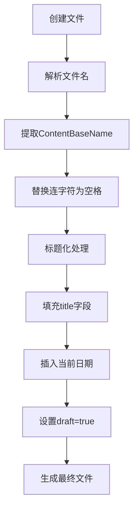

# 创建文章

<cite>
**Referenced Files in This Document **  
- [archetypes/default.md](file://archetypes/default.md)
- [content/posts/my-first-post.md](file://content/posts/my-first-post.md)
- [hugo.toml](file://hugo.toml)
- [themes/void/archetypes/default.md](file://themes/void/archetypes/default.md)
</cite>

## 目录
1. [简介](#简介)
2. [使用Hugo命令创建新文章](#使用hugo命令创建新文章)
3. [Markdown文件命名规范](#markdown文件命名规范)
4. [Front Matter字段说明](#front-matter字段说明)
5. [文章创建与发布流程示例](#文章创建与发布流程示例)
6. [手动创建注意事项](#手动创建注意事项)

## 简介
本文档详细说明如何在基于Hugo的博客系统中创建新文章。通过利用Hugo内置的`hugo new`命令和archetypes模板机制，用户可以快速生成结构化、标准化的文章文件。文档将介绍从文章创建到发布的完整流程，并解释关键配置和最佳实践。

## 使用Hugo命令创建新文章

Hugo提供了便捷的命令行工具来创建新文章。推荐使用以下命令：

```bash
hugo new posts/your-title.md
```

该命令会基于archetypes模板自动生成一个新的Markdown文件。Hugo首先检查项目根目录下的`archetypes/default.md`文件，如果不存在，则会回退到主题目录中的`themes/void/archetypes/default.md`模板。

此机制确保了即使没有自定义模板，也能使用主题提供的默认模板创建文章，保证了内容结构的一致性。

**Section sources**
- [archetypes/default.md](file://archetypes/default.md)
- [themes/void/archetypes/default.md](file://themes/void/archetypes/default.md)

## Markdown文件命名规范

为确保URL友好性和跨平台兼容性，建议遵循以下命名规范：

- 使用小写字母
- 单词间使用连字符（-）分隔
- 避免使用空格、特殊字符或中文
- 采用描述性的、有意义的标题

例如，一篇关于"我的第一篇文章"的博客应命名为`my-first-post.md`，而不是`My First Post.md`或`我的第一篇文章.md`。

良好的命名习惯有助于SEO优化，并确保在所有操作系统和Web服务器上都能正确解析。

**Section sources**
- [content/posts/my-first-post.md](file://content/posts/my-first-post.md)

## Front Matter字段说明

Front Matter是位于Markdown文件顶部的元数据块，用于定义文章的属性。本项目使用TOML格式（以`+++`包围），包含以下关键字段：

- `title`: 文章显示标题，可包含空格和特殊字符
- `date`: 文章创建日期时间，采用ISO 8601格式
- `draft`: 草稿状态标识，true表示草稿，false表示已发布

这些元数据由archetype模板自动填充，其中`.File.ContentBaseName`变量会将文件名中的连字符转换为空格，并进行标题化处理，确保标题的可读性。



**Diagram sources **
- [archetypes/default.md](file://archetypes/default.md)
- [themes/void/archetypes/default.md](file://themes/void/archetypes/default.md)

**Section sources**
- [archetypes/default.md](file://archetypes/default.md)

## 文章创建与发布流程示例

以创建`my-first-post.md`为例，展示完整的创建到发布流程：

1. 执行命令：`hugo new posts/my-first-post.md`
2. Hugo基于archetype模板生成文件
3. 编辑生成的Markdown文件，添加正文内容
4. 将`draft = true`修改为`draft = false`以发布文章
5. 构建并部署网站

生成的文章初始结构如下：
[SPEC SYMBOL](file://content/posts/my-first-post.md#L0-L9)

该流程确保了所有文章都具有一致的元数据结构，便于后续的主题渲染和内容管理。

**Section sources**
- [content/posts/my-first-post.md](file://content/posts/my-first-post.md)

## 手动创建注意事项

虽然推荐使用`hugo new`命令，但在手动创建文章时需注意：

- 确保文件路径正确：文章应放置在`content/posts/`目录下
- 必须包含完整的Front Matter元数据
- 正确设置文件扩展名为`.md`
- 遵循项目的命名约定
- 检查日期格式是否符合ISO 8601标准
- 确认草稿状态设置正确

手动创建时容易遗漏元数据或格式错误，因此建议优先使用自动化命令来保证一致性。

**Section sources**
- [hugo.toml](file://hugo.toml)