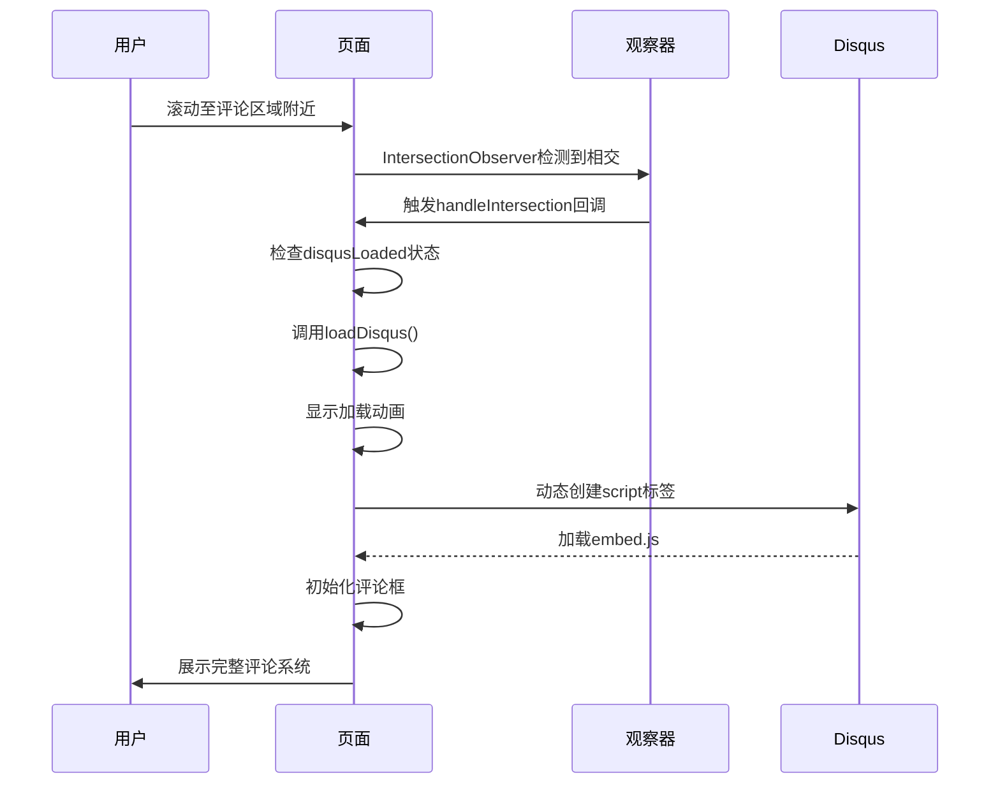

# Disqus评论系统集成与懒加载机制

<cite>
**本文档引用的文件**
- [disqus_lazy.html](file://themes/void/layouts/partials/disqus_lazy.html)
- [disqus-lazy.js](file://themes/void/assets/js/disqus-lazy.js)
- [hugo.toml](file://hugo.toml)
</cite>

## 目录
1. [简介](#简介)
2. [Disqus集成配置方法](#disqus集成配置方法)
3. [模板结构与条件渲染](#模板结构与条件渲染)
4. [懒加载实现原理](#懒加载实现原理)
5. [Intersection Observer API应用分析](#intersection-observer-api应用分析)
6. [性能优化与阈值调整](#性能优化与阈值调整)
7. [调试技巧与常见问题](#调试技巧与常见问题)
8. [总结](#总结)

## 简介
本文详细解析基于Hugo静态站点框架中Disqus评论系统的集成方式及其懒加载实现机制。重点阐述`disqus_lazy.html`模板如何通过条件判断动态插入评论容器，并结合JavaScript脚本使用Intersection Observer API实现滚动触发式加载，从而显著减少首屏资源消耗、提升页面加载速度。

## Disqus集成配置方法
在Hugo项目中启用Disqus评论功能需在站点配置文件中设置服务参数。通过`site.Config.Services.Disqus.Shortname`读取用户专属的Shortname标识符，该配置决定了评论系统加载的目标域名。

```toml
[services.disqus]
  shortname = "your-disqus-shortname"
```

此配置项作为条件判断的基础，仅当存在有效Shortname时才会渲染评论组件，避免无效资源加载。

**Section sources**
- [hugo.toml](file://hugo.toml#L0-L27)
- [disqus_lazy.html](file://themes/void/layouts/partials/disqus_lazy.html#L0-L22)

## 模板结构与条件渲染
`disqus_lazy.html`是核心模板文件，采用Hugo模板语法进行条件渲染和上下文预设：

### 条件判断与容器定义
模板首先检查`$disqusShortname`是否存在，确保仅在配置正确时输出HTML结构：
```html
{{ $disqusShortname := site.Config.Services.Disqus.Shortname }}
{{ if $disqusShortname }}
  <!-- 评论容器 -->
{{ end }}
```

### 数据属性预设
评论容器`disqus_thread_container`通过`data-page-url`和`data-page-identifier`两个自定义属性预设上下文信息：
- `data-page-url`: 使用`.Permalink`绑定当前页面永久链接
- `data-page-identifier`: 基于`.File.UniqueID`生成唯一标识符

这些属性为后续JavaScript初始化提供必要参数，确保每篇文章拥有独立的评论线程。

### 加载按钮与状态指示
模板包含一个可交互的加载按钮和隐藏的加载动画指示器：
- **加载按钮**：点击后触发`loadDisqus()`函数，展示视觉反馈
- **加载动画**：初始隐藏，在脚本中动态显示以提示用户等待

**Section sources**
- [disqus_lazy.html](file://themes/void/layouts/partials/disqus_lazy.html#L0-L22)

## 懒加载实现原理
整个懒加载流程由前端JavaScript控制，分为初始化、监听、加载三个阶段。

### 脚本加载时机
模板通过Hugo资源管道引入并处理JS文件：
```go
{{ $disqusJs := resources.Get "js/disqus-lazy.js" | resources.Minify | resources.Fingerprint }}
<script src="{{ $disqusJs.RelPermalink }}"></script>
```
该机制保证脚本经过压缩与哈希指纹处理，提升缓存效率。

### 全局变量传递
模板内联脚本将Disqus Shortname注入全局变量：
```javascript
var DISQUS_SHORTNAME = '{{ $disqusShortname }}';
```
此变量供外部脚本安全访问，避免跨域或作用域问题。

### 初始化入口
脚本在DOM加载完成后执行主函数：
```javascript
document.addEventListener("DOMContentLoaded", initDisqus);
```

**Section sources**
- [disqus_lazy.html](file://themes/void/layouts/partials/disqus_lazy.html#L24-L36)
- [disqus-lazy.js](file://themes/void/assets/js/disqus-lazy.js#L51-L52)

## Intersection Observer API应用分析
`initDisqus`函数为核心逻辑入口，利用现代浏览器API实现智能加载。

### 配置函数定义
`disqus_config`函数从DOM元素提取数据属性，设置Disqus运行时上下文：
```javascript
this.page.url = container.getAttribute("data-page-url");
this.page.identifier = container.getAttribute("data-page-identifier");
```
该函数必须在Disqus脚本加载前定义，否则将导致初始化失败。

### 视口交叉检测
使用`IntersectionObserver`监听页面滚动行为：
```javascript
var observer = new IntersectionObserver(handleIntersection, {
  rootMargin: "0px 0px 200px 0px"
});
```
- `rootMargin`设置为底部偏移200px，实现“提前加载”效果
- 当评论容器进入视口（含预设边距）时触发回调

### 回调处理逻辑
`handleIntersection`遍历观察条目，判断是否相交：
- 若相交且未加载，则调用`loadDisqus()`
- 成功触发后立即取消对该元素的观察，防止重复执行

### 动态脚本注入
`loadDisqus`函数负责实际加载过程：
1. 设置`window.disqusLoaded`标志位防止重复加载
2. 隐藏加载按钮，显示旋转动画
3. 创建`<script>`标签，指向`https://{shortname}.disqus.com/embed.js`
4. 添加时间戳属性避免缓存
5. 插入到文档头部或体部触发下载



**Diagram sources**
- [disqus-lazy.js](file://themes/void/assets/js/disqus-lazy.js#L1-L48)

**Section sources**
- [disqus-lazy.js](file://themes/void/assets/js/disqus-lazy.js#L1-L48)

## 性能优化与阈值调整
懒加载机制的核心优势在于延迟非关键资源的加载，具体体现在：

### 首屏性能提升
- 初始页面不请求任何Disqus相关资源（JS/CSS/IFrame）
- 减少DNS查询、TCP连接、HTTP请求等网络开销
- 提高Lighthouse评分中的FCP（First Contentful Paint）与LCP（Largest Contentful Paint）

### 可配置加载距离
通过修改`rootMargin`参数可调节触发灵敏度：
```javascript
rootMargin: "0px 0px 300px 0px" // 更早加载
rootMargin: "0px 0px 100px 0px" // 更晚加载
```
建议根据页面平均高度和用户体验目标进行微调。

### 内存与事件管理
- 使用一次性观察模式（unobserve后不再监听），降低内存占用
- 依赖原生API而非定时轮询，减少CPU消耗

**Section sources**
- [disqus-lazy.js](file://themes/void/assets/js/disqus-lazy.js#L40-L45)

## 调试技巧与常见问题
### 验证加载触发
1. 打开开发者工具Network面板
2. 滚动页面接近评论区
3. 观察是否有`embed.js`及相关资源请求出现

### 检查数据属性
在Elements面板确认容器是否正确渲染了`data-page-url`和`data-page-identifier`。

### 测试无Shortname场景
临时移除配置中的Shortname，验证模板是否完全不渲染评论组件。

### 常见问题排查
| 问题现象 | 可能原因 | 解决方案 |
|--------|--------|--------|
| 评论无法加载 | Shortname未配置 | 检查hugo.toml配置 |
| 一直显示加载中 | 跨域阻止脚本加载 | 检查浏览器安全策略 |
| 多次触发加载 | 未正确取消观察 | 确保调用了observer.unobserve() |
| 样式错乱 | 主题CSS冲突 | 检查shadow DOM封装情况 |

**Section sources**
- [disqus_lazy.html](file://themes/void/layouts/partials/disqus_lazy.html#L0-L36)
- [disqus-lazy.js](file://themes/void/assets/js/disqus-lazy.js#L1-L52)

## 总结
本文深入剖析了Hugo主题中Disqus评论系统的懒加载实现机制。通过`disqus_lazy.html`模板的条件渲染与上下文预设，配合`disqus-lazy.js`中Intersection Observer API的精准控制，实现了按需加载评论内容的高性能方案。该设计不仅提升了首屏加载速度，还保持了良好的用户体验，是现代Web性能优化的最佳实践之一。