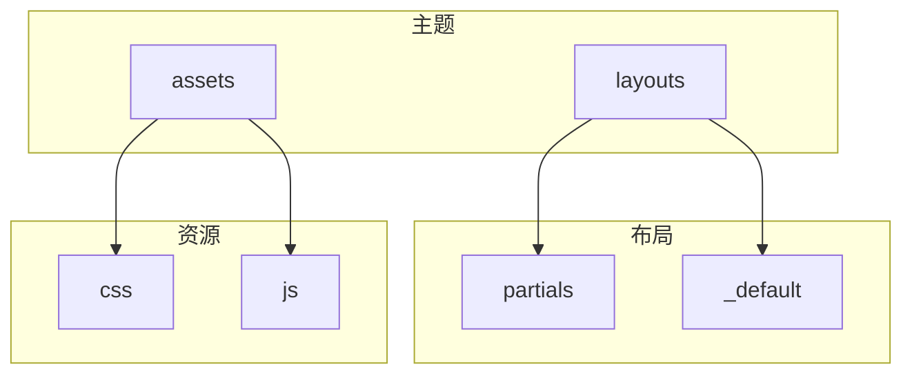
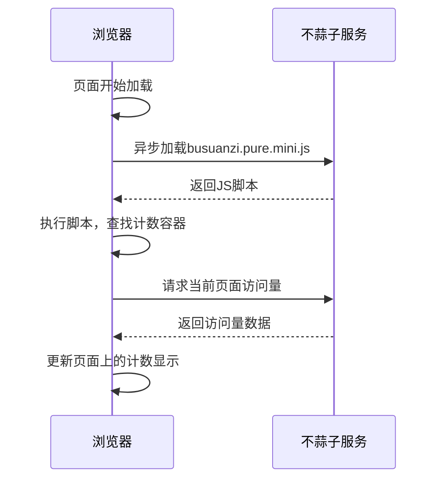
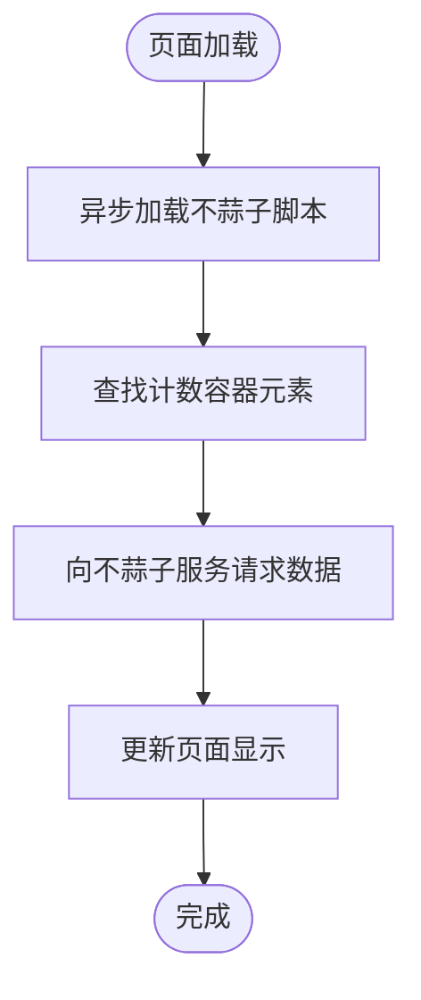
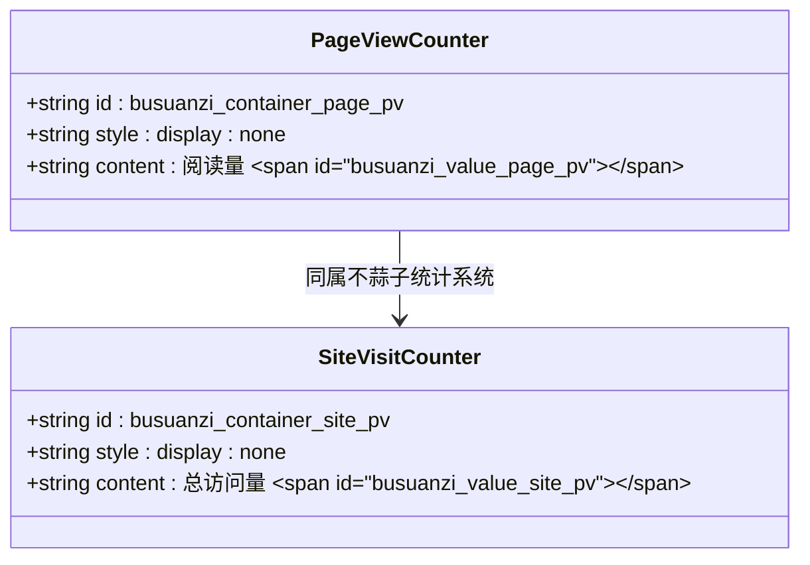
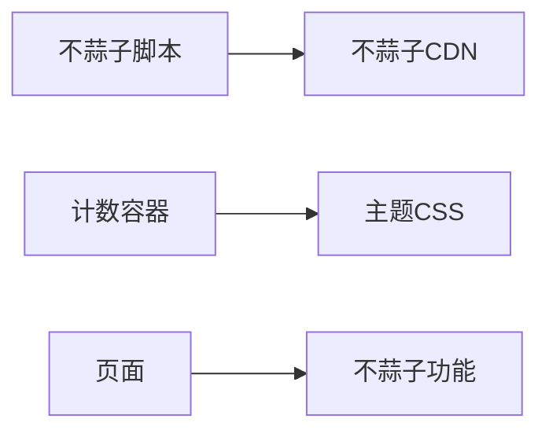

# 不蒜子访问统计集成

<cite>
**本文档引用的文件**
- [footer.html](file://themes/void/layouts/partials/footer.html)
- [single.html](file://themes/void/layouts/_default/single.html)
- [main.css](file://themes/void/assets/css/main.css)
- [style.css](file://themes/void/assets/css/style.css)
</cite>

## 目录
1. [简介](#简介)
2. [项目结构](#项目结构)
3. [核心组件](#核心组件)
4. [架构概述](#架构概述)
5. [详细组件分析](#详细组件分析)
6. [依赖分析](#依赖分析)
7. [性能考虑](#性能考虑)
8. [故障排除指南](#故障排除指南)
9. [结论](#结论)

## 简介
本文档旨在阐述不蒜子（Busuanzi）访问统计功能在静态网站中的集成方法与工作原理。通过分析Hugo主题Void的实现方式，详细说明如何在`footer.html`中引入不蒜子计数脚本，并通过CSS类名绑定页面浏览量显示区域。同时解释服务端自动计数机制与客户端异步渲染的协作流程，提供验证统计是否生效的调试手段，并补充常见问题解决方案。

## 项目结构
该项目采用Hugo静态站点生成器，使用Void主题进行内容展示。主题结构清晰，包含布局、部分模板、资源文件等。不蒜子统计功能主要通过布局文件和部分模板实现，相关代码分布在`layouts`和`assets`目录下。

**图示来源**
- [footer.html](file://themes/void/layouts/partials/footer.html)
- [single.html](file://themes/void/layouts/_default/single.html)

## 核心组件
不蒜子访问统计的核心在于其轻量级的JavaScript脚本和简单的HTML元素绑定机制。通过在页面中添加特定ID的span元素，不蒜子脚本能够自动识别并更新访问计数。

**组件来源**
- [footer.html](file://themes/void/layouts/partials/footer.html#L90-L92)
- [single.html](file://themes/void/layouts/_default/single.html#L38-L43)

## 架构概述
不蒜子统计功能的架构主要包括三个部分：脚本引入、计数容器和数据渲染。脚本在页面底部异步加载，确保不影响页面主要内容的渲染速度。计数容器通过特定的ID标识，供脚本查找并更新内容。

**图示来源**
- [footer.html](file://themes/void/layouts/partials/footer.html#L92)
- [single.html](file://themes/void/layouts/_default/single.html#L39)

## 详细组件分析

### 统计脚本集成分析
不蒜子统计脚本通过异步方式引入，避免阻塞页面其他资源的加载。脚本地址为`//busuanzi.ibruce.info/busuanzi/2.3/busuanzi.pure.mini.js`，使用双斜线协议确保在HTTP和HTTPS环境下都能正常加载。

**图示来源**
- [footer.html](file://themes/void/layouts/partials/footer.html#L92)

### 计数容器绑定分析
页面浏览量的显示通过两个关键的HTML元素实现：`busuanzi_container_page_pv`用于控制整个计数区域的显示与隐藏，`busuanzi_value_page_pv`则是实际显示数字的地方。这种设计允许在数据加载前隐藏空白的计数区域。

**图示来源**
- [single.html](file://themes/void/layouts/_default/single.html#L39)
- [footer.html](file://themes/void/layouts/partials/footer.html#L90)

## 依赖分析
不蒜子统计功能依赖于外部CDN服务，其稳定性直接影响统计数据显示。同时，该功能与网站的主题样式存在一定的耦合关系，需要确保相关CSS规则不会影响计数文本的正常显示。

**图示来源**
- [footer.html](file://themes/void/layouts/partials/footer.html)
- [main.css](file://themes/void/assets/css/main.css)

## 性能考虑
由于不蒜子脚本是异步加载的，对页面主要性能指标的影响较小。然而，在网络状况不佳的情况下，可能会出现计数延迟显示的情况。建议在用户体验设计上考虑这一因素，避免用户误以为统计功能失效。

## 故障排除指南
当遇到不蒜子统计不显示或延迟更新的问题时，可按照以下步骤进行排查：

1. 检查浏览器控制台是否有脚本加载错误
2. 确认页面中是否存在正确的计数容器ID
3. 验证网络连接是否正常，能否访问不蒜子CDN
4. 检查是否有浏览器扩展程序阻止了第三方脚本的执行

**问题解决来源**
- [footer.html](file://themes/void/layouts/partials/footer.html)
- [single.html](file://themes/void/layouts/_default/single.html)

## 结论
不蒜子访问统计是一种简单有效的网站流量监测方案，特别适合静态网站使用。通过合理的集成方式和充分的测试，可以为网站运营提供有价值的访问数据支持。在实际应用中，应注意监控其稳定性和性能表现，确保统计数据的准确性和及时性。