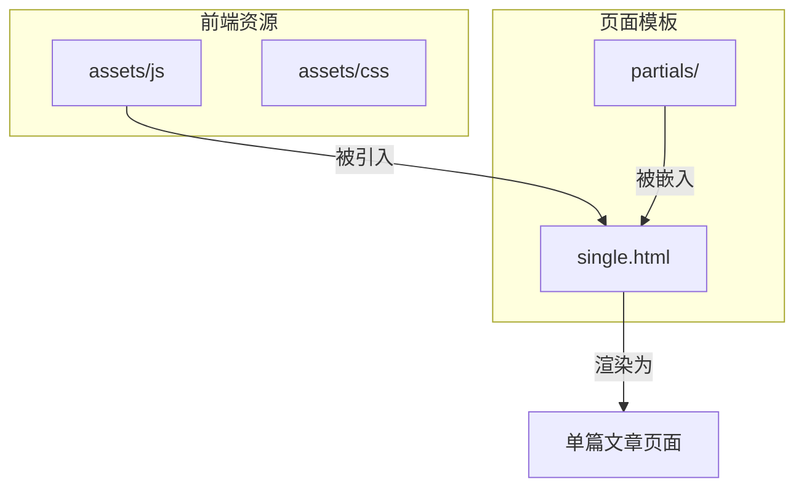
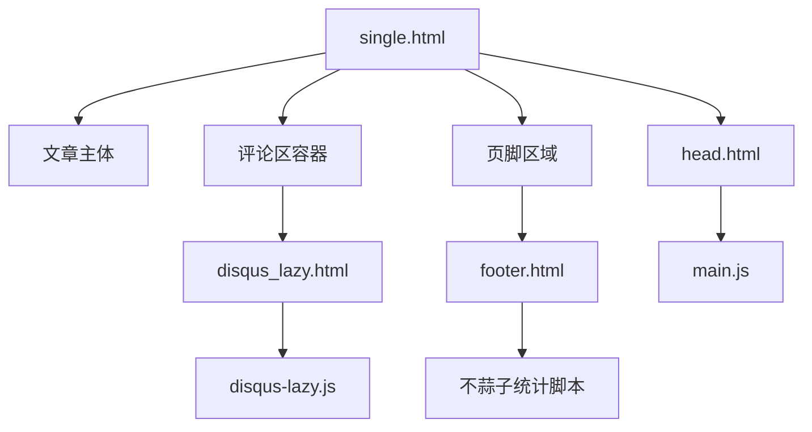
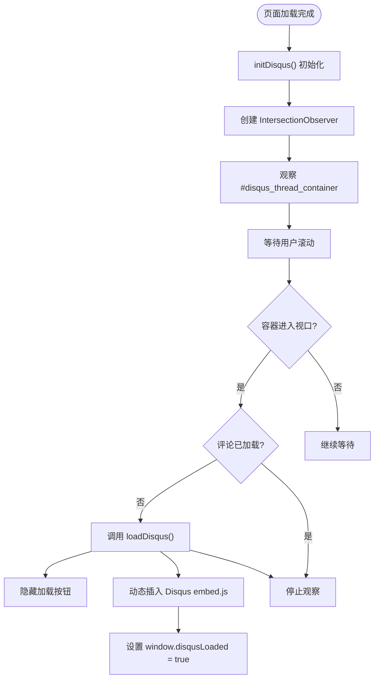
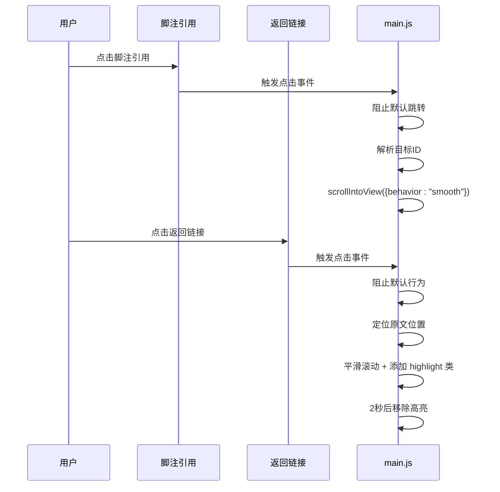
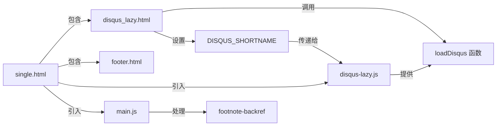

# 功能模块详解

<cite>
**本文档引用的文件**
- [disqus-lazy.js](file://themes/void/assets/js/disqus-lazy.js)
- [main.js](file://themes/void/assets/js/main.js)
- [disqus_lazy.html](file://themes/void/layouts/partials/disqus_lazy.html)
- [footer.html](file://themes/void/layouts/partials/footer.html)
- [single.html](file://themes/void/layouts/_default/single.html)
</cite>

## 目录
1. [简介](#简介)
2. [项目结构概览](#项目结构概览)
3. [核心功能组件分析](#核心功能组件分析)
4. [架构整合与页面集成](#架构整合与页面集成)
5. [详细组件剖析](#详细组件剖析)
6. [依赖关系分析](#依赖关系分析)
7. [性能优化建议](#性能优化建议)
8. [调试技巧与常见问题](#调试技巧与常见问题)
9. [总结](#总结)

## 简介
本文深入解析基于 Hugo 框架的博客主题中多个关键功能模块的实现机制。重点包括 Disqus 评论系统的懒加载策略、脚注交互逻辑、访问量统计集成以及这些功能在单篇文章页面中的组合方式。通过代码级分析，帮助开发者理解用户体验优化的技术细节，并提供可复用的实践指导。

## 项目结构概览
本项目采用典型的 Hugo 主题结构，核心功能分布在 `assets/js`（JavaScript 资源）和 `layouts/partials`（模板片段）目录下。主要关注以下路径：
- JavaScript 实现：`themes/void/assets/js/`
- 模板组件：`themes/void/layouts/partials/`
- 页面模板：`themes/void/layouts/_default/single.html`



**Diagram sources**
- [single.html](file://themes/void/layouts/_default/single.html#L1-L82)
- [disqus_lazy.html](file://themes/void/layouts/partials/disqus_lazy.html#L1-L37)

**Section sources**
- [single.html](file://themes/void/layouts/_default/single.html#L1-L82)

## 核心功能组件分析
系统集成了三大核心功能：Disqus 评论懒加载、脚注高亮滚动、不蒜子访问统计。这些功能分别由独立的 JavaScript 文件和 HTML 模板实现，最终在 `single.html` 中组合呈现。

**Section sources**
- [disqus-lazy.js](file://themes/void/assets/js/disqus-lazy.js#L1-L52)
- [main.js](file://themes/void/assets/js/main.js#L1-L88)
- [footer.html](file://themes/void/layouts/partials/footer.html#L1-L96)

## 架构整合与页面集成
各功能模块通过 Hugo 模板系统无缝集成到单篇文章页面中。主模板负责组织结构，局部模板注入具体功能，JavaScript 文件处理交互逻辑。



**Diagram sources**
- [single.html](file://themes/void/layouts/_default/single.html#L1-L82)
- [disqus_lazy.html](file://themes/void/layouts/partials/disqus_lazy.html#L1-L37)
- [footer.html](file://themes/void/layouts/partials/footer.html#L1-L96)
- [head.html](file://themes/void/layouts/partials/head.html#L1-L17)

**Section sources**
- [single.html](file://themes/void/layouts/_default/single.html#L1-L82)

## 详细组件剖析

### Disqus 评论懒加载机制
该功能通过 Intersection Observer API 实现，仅当用户滚动至评论区可视范围内时才加载 Disqus 脚本，显著提升首屏加载性能。

#### 工作流程图解


**Diagram sources**
- [disqus-lazy.js](file://themes/void/assets/js/disqus-lazy.js#L1-L52)

**Section sources**
- [disqus-lazy.js](file://themes/void/assets/js/disqus-lazy.js#L1-L52)
- [disqus_lazy.html](file://themes/void/layouts/partials/disqus_lazy.html#L1-L37)

### 脚注高亮与平滑滚动
`main.js` 实现了双向脚注导航的平滑滚动与视觉反馈，增强阅读体验。

#### 交互序列图


**Diagram sources**
- [main.js](file://themes/void/assets/js/main.js#L6-L50)

**Section sources**
- [main.js](file://themes/void/assets/js/main.js#L1-L88)
- [head.html](file://themes/void/layouts/partials/head.html#L1-L17)

### 不蒜子访问量统计
通过在页脚嵌入第三方脚本，实现轻量级站点访问数据展示。

#### 集成逻辑说明
```mermaid
flowchart LR
A[footer.html] --> B[插入 busuanzi.pure.mini.js]
B --> C[定义显示容器]
C --> D[id="busuanzi_container_site_pv"]
C --> E[id="busuanzi_container_page_pv"]
D --> F[全局访问量]
E --> G[当前页面访问量]
B --> H[异步加载]
H --> I[自动填充 span 值]
```

**Diagram sources**
- [footer.html](file://themes/void/layouts/partials/footer.html#L1-L96)

**Section sources**
- [footer.html](file://themes/void/layouts/partials/footer.html#L1-L96)

## 依赖关系分析
各组件间存在明确的依赖层级，确保功能按序初始化并正确交互。



**Diagram sources**
- [disqus-lazy.js](file://themes/void/assets/js/disqus-lazy.js#L1-L52)
- [disqus_lazy.html](file://themes/void/layouts/partials/disqus_lazy.html#L1-L37)
- [main.js](file://themes/void/assets/js/main.js#L1-L88)
- [single.html](file://themes/void/layouts/_default/single.html#L1-L82)

**Section sources**
- [disqus-lazy.js](file://themes/void/assets/js/disqus-lazy.js#L1-L52)
- [main.js](file://themes/void/assets/js/main.js#L1-L88)
- [single.html](file://themes/void/layouts/_default/single.html#L1-L82)

## 性能优化建议
1. **延迟加载有效性**：Disqus 懒加载避免了非必要资源请求，尤其利于移动端用户。
2. **Intersection Observer 优势**：相比传统滚动监听，更高效且不影响主线程。
3. **脚本合并建议**：可考虑将 `main.js` 与 `disqus-lazy.js` 合并以减少请求数。
4. **统计脚本异步化**：不蒜子脚本已使用 async，确保不影响页面渲染。

## 调试技巧与常见问题
- **Disqus 加载失败**：检查 `site.Config.Services.Disqus.Shortname` 是否配置正确。
- **脚注链接失效**：确认 Markdown 渲染器生成的 ID 格式与脚本选择器匹配。
- **访问量不显示**：检查网络是否可访问 `busuanzi.ibruce.info`，或尝试更换 CDN。
- **调试工具**：利用浏览器开发者工具监控 Network 请求与 Console 日志输出。

**Section sources**
- [disqus-lazy.js](file://themes/void/assets/js/disqus-lazy.js#L1-L52)
- [main.js](file://themes/void/assets/js/main.js#L1-L88)
- [footer.html](file://themes/void/layouts/partials/footer.html#L1-L96)

## 总结
本文系统性地剖析了博客系统中三大用户体验相关功能的实现原理。Disqus 懒加载通过现代浏览器 API 优化性能；脚注交互提升了内容可读性；不蒜子统计提供了简洁的数据洞察。这些功能通过模块化设计与 Hugo 模板系统有机结合，展现了良好的架构分离与可维护性。开发者可借鉴此模式优化自身项目的加载性能与用户交互体验。