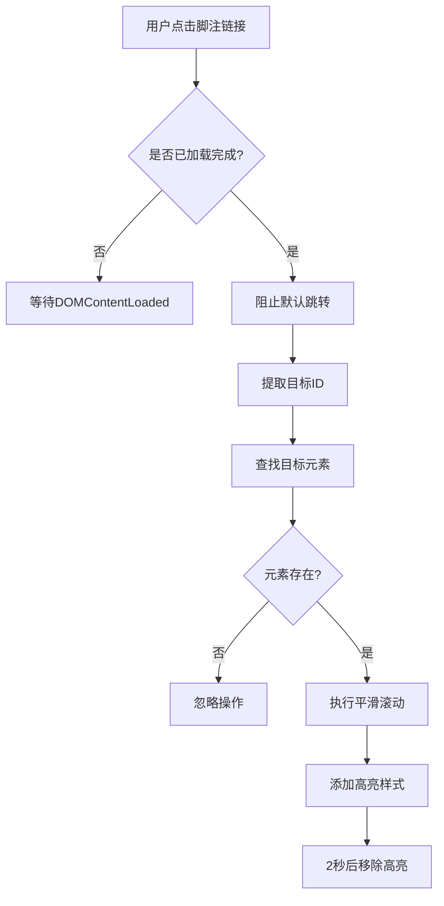
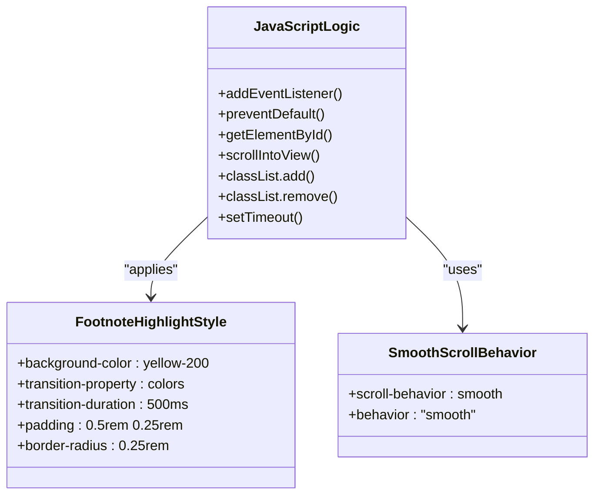
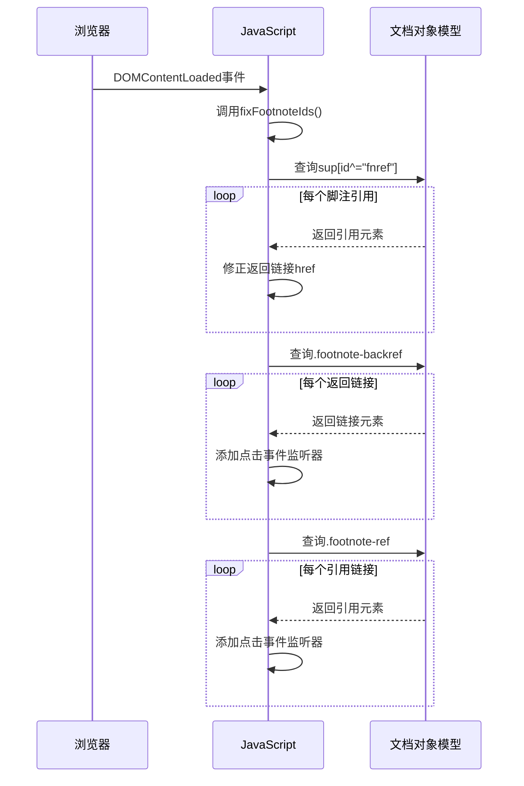

# 脚注高亮与平滑滚动交互

<cite>
**Referenced Files in This Document **   
- [main.js](file://themes/void/assets/js/main.js)
- [main.css](file://themes/void/assets/css/main.css)
- [js.html](file://themes/void/layouts/partials/head/js.html)
</cite>

## 目录
1. [引言](#引言)
2. [核心功能实现](#核心功能实现)
3. [DOM选择器与事件委托机制](#dom选择器与事件委托机制)
4. [视觉高亮与动画过渡](#视觉高亮与动画过渡)
5. [代码结构与执行流程](#代码结构与执行流程)
6. [自定义样式与配置建议](#自定义样式与配置建议)
7. [浏览器兼容性处理](#浏览器兼容性处理)
8. [总结](#总结)

## 引言

本文档深入分析了基于Hugo静态网站生成器的"void"主题中，脚注交互增强功能的具体实现。该功能通过JavaScript实现了从文章正文到脚注以及从脚注返回正文的双向导航体验，包含点击事件监听、目标元素高亮和页面平滑滚动等核心特性。文档将详细解析`main.js`中的关键代码逻辑，说明其如何利用现代Web API提升用户体验，并提供可定制化的修改建议。

## 核心功能实现

脚注交互系统主要实现了两个方向的导航功能：从文章内的脚注引用链接跳转至底部脚注列表项，以及从脚注列表项的返回链接跳转回原文引用位置。这一双向导航机制极大地提升了长篇文章的可读性和易用性。

系统通过`document.addEventListener("DOMContentLoaded", ...)`确保在DOM完全加载后才执行脚注相关的初始化代码，避免因元素未就绪而导致的错误。整个交互逻辑被封装在一个匿名函数中，保证了作用域的独立性，防止全局污染。

**Section sources**
- [main.js](file://themes/void/assets/js/main.js#L0-L88)

## DOM选择器与事件委托机制

### 选择器应用策略

脚注系统使用了精确的CSS类名选择器来定位相关元素：
- `.footnote-backref`：用于选择所有脚注返回链接（从脚注指向原文的链接）
- `.footnote-ref`：用于选择文章正文中所有的脚注引用链接
- `sup[id^="fnref"]`：用于选择以"fnref"开头的上标元素，这些通常是脚注引用的容器

```javascript
const backRefs = document.querySelectorAll(".footnote-backref");
const footnoteRefs = document.querySelectorAll(".footnote-ref");
```

这种基于类名的选择方式具有良好的稳定性和可维护性，即使HTML结构发生变化，只要类名保持不变，JavaScript代码仍能正常工作。

### 事件监听与委托

系统采用了直接事件绑定而非事件委托的方式，为每个匹配的元素单独添加点击事件监听器。这种方式虽然会创建多个事件处理器，但对于脚注这种数量有限且固定的场景是合理且高效的。

当用户点击脚注链接时，事件处理器首先调用`e.preventDefault()`阻止默认的锚点跳转行为，然后提取链接的`href`属性值，去除开头的`#`符号后作为目标元素的ID进行查找。



**Diagram sources **
- [main.js](file://themes/void/assets/js/main.js#L15-L45)

**Section sources**
- [main.js](file://themes/void/assets/js/main.js#L10-L45)

## 视觉高亮与动画过渡

### 高亮效果实现

视觉高亮是通过动态添加和移除CSS类名来实现的。当目标脚注项被定位到时，系统会立即为其添加`footnote-highlight`类：

```javascript
targetElement.classList.add("footnote-highlight");
setTimeout(() => {
  targetElement.classList.remove("footnote-highlight");
}, 2000);
```

这个高亮效果持续2秒后自动消失，既提供了足够的视觉反馈时间，又不会永久干扰用户的阅读体验。

### CSS过渡动画

对应的CSS规则定义了高亮的视觉表现和过渡效果：

```css
.prose .footnote-highlight {
  @apply bg-yellow-200 transition-colors duration-500 px-2 py-1 rounded;
}
```

这里使用了Tailwind CSS的实用类：
- `bg-yellow-200`：设置背景色为浅黄色
- `transition-colors`：仅对颜色相关的属性应用过渡效果
- `duration-500`：设置过渡持续时间为500毫秒
- `px-2 py-1`：添加内边距
- `rounded`：添加圆角

这种设计确保了高亮效果的变化是平滑渐变的，而不是突兀的切换，提升了整体的交互质感。



**Diagram sources **
- [main.css](file://themes/void/assets/css/main.css#L99-L103)
- [main.js](file://themes/void/assets/js/main.js#L30-L35)

**Section sources**
- [main.css](file://themes/void/assets/css/main.css#L99-L103)

## 代码结构与执行流程

### 主要函数组件

代码库中包含了几个关键的功能模块：

1. **主事件监听器**：在DOM加载完成后启动整个脚注系统
2. **返回链接处理器**：处理从脚注到原文的导航
3. **引用链接处理器**：处理从原文到脚注的导航
4. **ID修复函数**：`fixFootnoteIds()`用于修正可能存在的脚注ID不一致问题

`fixFootnoteIds()`函数特别重要，它遍历所有脚注引用，检查并修正返回链接的目标，确保双向导航的一致性。这在某些Markdown解析器生成不规范HTML时尤为重要。

### 执行顺序与依赖

系统的执行遵循严格的顺序：
1. 页面加载完成触发`DOMContentLoaded`事件
2. 调用`fixFootnoteIds()`修复潜在的ID问题
3. 查找并为所有`.footnote-backref`元素添加点击事件
4. 查找并为所有`.footnote-ref`元素添加点击事件

这种先修复后绑定的顺序确保了即使原始HTML存在问题，也能在交互前得到纠正。



**Diagram sources **
- [main.js](file://themes/void/assets/js/main.js#L62-L87)
- [main.js](file://themes/void/assets/js/main.js#L10-L45)

**Section sources**
- [main.js](file://themes/void/assets/js/main.js#L62-L87)

## 自定义样式与配置建议

### 修改高亮样式

用户可以通过编辑`main.css`文件中的`.footnote-highlight`类来自定义高亮效果。例如，可以更改背景色、持续时间或添加其他视觉效果：

```css
/* 更改高亮颜色为浅蓝色 */
.prose .footnote-highlight {
  background-color: #dbeafe;
  transition-duration: 700ms;
}

/* 或者使用边框高亮而非背景色 */
.prose .footnote-highlight {
  border: 2px solid #3b82f6;
  padding: 0.25rem;
  background-color: transparent;
}
```

### 关闭动画效果

如果希望关闭平滑滚动或高亮动画，可以进行以下修改：

```javascript
// 关闭平滑滚动，改为瞬间跳转
targetElement.scrollIntoView({ behavior: "auto" });

// 完全移除高亮效果
// 注释或删除以下两行
// targetElement.classList.add("footnote-highlight");
// setTimeout(() => { ... }, 2000);
```

### 调整高亮持续时间

可以通过修改`setTimeout`的延迟参数来调整高亮显示的时间：

```javascript
// 将高亮时间从2秒延长至3秒
setTimeout(() => {
  targetElement.classList.remove("footnote-highlight");
}, 3000);
```

## 浏览器兼容性处理

### 平滑滚动支持

`scrollIntoView({ behavior: "smooth" })`方法在现代浏览器中得到了广泛支持，但在一些旧版本浏览器中可能不被识别。为了确保兼容性，可以添加简单的特征检测：

```javascript
if ('scrollBehavior' in document.documentElement.style) {
  // 支持平滑滚动
  targetElement.scrollIntoView({ behavior: "smooth" });
} else {
  // 降级为普通滚动
  targetElement.scrollIntoView();
}
```

### 事件监听兼容性

`addEventListener`方法在所有现代浏览器中都受支持。对于需要支持非常旧的IE版本的情况，可以添加兼容性包装：

```javascript
function addEvent(element, event, handler) {
  if (element.addEventListener) {
    element.addEventListener(event, handler, false);
  } else if (element.attachEvent) {
    element.attachEvent('on' + event, handler);
  }
}
```

### CSS过渡兼容性

所使用的CSS过渡属性具有良好的浏览器兼容性。`transition-colors`和`duration-500`等Tailwind实用类会被编译为标准的CSS属性，确保在各种环境中都能正确渲染。

## 总结

本文档详细解析了"void"主题中脚注交互功能的技术实现。该系统通过简洁而有效的JavaScript代码，结合Tailwind CSS的现代化样式方案，创造了一个流畅的双向导航体验。其核心优势在于：
- 使用语义化的类名选择器确保稳定性
- 通过`scrollIntoView`实现原生平滑滚动
- 利用CSS类切换和过渡效果提供视觉反馈
- 包含ID修复机制增强鲁棒性

这套解决方案平衡了功能完整性、性能效率和可维护性，为技术博客和长篇文章提供了优秀的脚注交互体验。开发者可以根据具体需求轻松定制样式和行为，同时系统本身具备良好的浏览器兼容性基础。