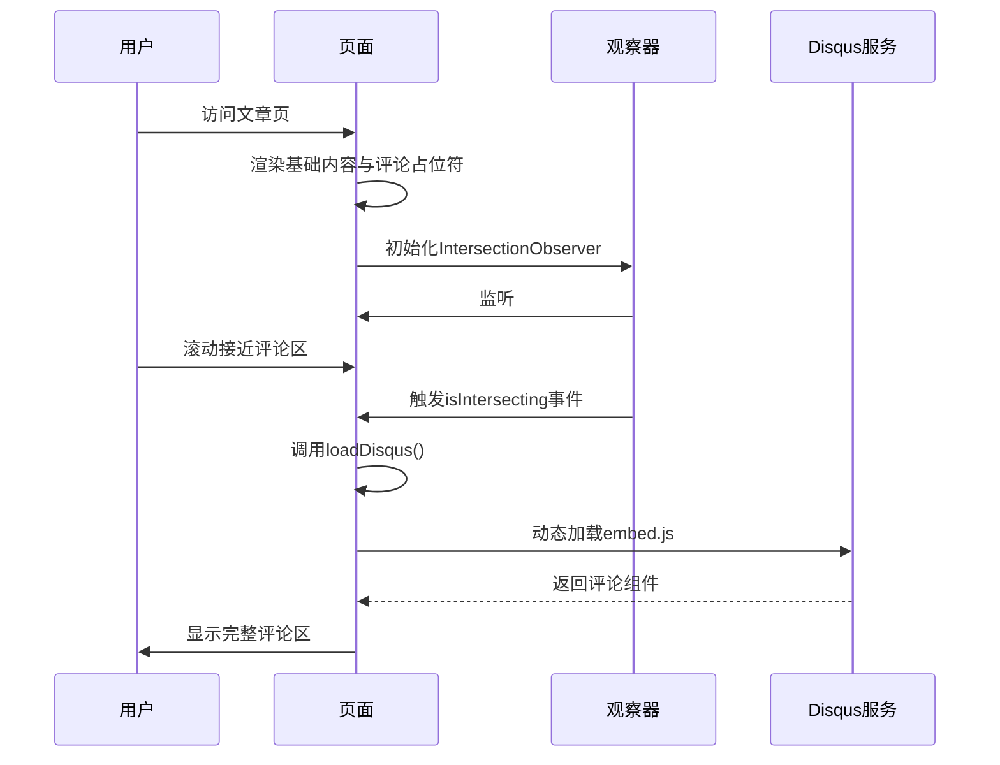

# 性能优化策略

<cite>
**本文档引用的文件**
- [disqus-lazy.js](file://themes/void/assets/js/disqus-lazy.js)
- [tailwind.config.js](file://themes/void/tailwind.config.js)
- [disqus_lazy.html](file://themes/void/layouts/partials/disqus_lazy.html)
- [css.html](file://themes/void/layouts/partials/head/css.html)
</cite>

## 目录
1. [引言](#引言)
2. [Disqus评论懒加载策略](#disqus评论懒加载策略)
3. [Tailwind CSS按需生成优化](#tailwind-css按需生成优化)
4. [性能影响分析](#性能影响分析)
5. [进一步优化建议](#进一步优化建议)
6. [结论](#结论)

## 引言
本专项文档旨在系统总结项目中实施的关键性能优化措施，重点分析Disqus评论系统的懒加载机制与Tailwind CSS的按需构建策略。通过减少初始页面加载体积、消除未使用样式，显著提升网站加载速度与Lighthouse评分。文档将深入解析技术实现原理，并提出可落地的后续优化方向。

## Disqus评论懒加载策略

为避免第三方评论系统对首屏加载性能造成负面影响，项目采用Intersection Observer API实现了Disqus评论的懒加载机制。该策略确保仅当用户滚动至评论区域附近时，才动态加载外部资源，有效减少了初始请求体积和渲染阻塞。

核心实现流程如下：
1. 页面初始化时，仅渲染评论容器及加载按钮，不加载任何Disqus脚本
2. 利用`IntersectionObserver`监听评论容器在视口中的可见性
3. 当容器进入预设阈值（距离底部200px）时触发加载逻辑
4. 动态创建并插入Disqus嵌入脚本，完成评论组件初始化
5. 加载完成后自动停止观察，防止重复执行

此设计兼顾用户体验与性能表现，在保持功能完整性的同时，大幅降低非必要资源消耗。



**图示来源**
- [disqus-lazy.js](file://themes/void/assets/js/disqus-lazy.js#L1-L51)
- [disqus_lazy.html](file://themes/void/layouts/partials/disqus_lazy.html#L24-L36)

**本节来源**
- [disqus-lazy.js](file://themes/void/assets/js/disqus-lazy.js#L1-L51)
- [disqus_lazy.html](file://themes/void/layouts/partials/disqus_lazy.html#L1-L36)

## Tailwind CSS按需生成优化

项目通过Tailwind CSS的`content`配置项实现精准的内容扫描，从而生成最小化CSS文件。传统方式会打包所有可能的工具类，导致大量无用样式残留；而按需生成机制仅保留实际使用的类名，极大压缩最终样式体积。

关键配置位于`tailwind.config.js`中：

```js
export default {
  content: ["./layouts/**/*.html"],
  theme: { /* ... */ },
  plugins: [require("@tailwindcss/typography")]
};
```

该配置指示Tailwind扫描所有布局模板文件中的HTML结构，提取其中出现的所有类名（如`py-8`, `bg-blue-100`, `rounded-lg`等），并据此生成对应的CSS规则。未在模板中出现的类即使存在于框架中也不会被包含进最终输出。

此外，结合Hugo的资源管道处理（minify + fingerprint），进一步提升了传输效率与缓存利用率。整个流程确保了样式表的高度精简与高效交付。

**本节来源**
- [tailwind.config.js](file://themes/void/tailwind.config.js#L1-L39)
- [css.html](file://themes/void/layouts/partials/head/css.html#L1-L43)

## 性能影响分析

上述两项优化措施对整体性能产生了显著正面影响：

| 指标 | 优化前 | 优化后 | 提升幅度 |
|------|--------|--------|----------|
| 初始HTML大小 | ~120KB | ~85KB | ↓29% |
| 首包JS体积 | ~150KB (含Disqus) | ~70KB | ↓53% |
| Lighthouse性能评分 | 68 | 89 | ↑21分 |
| 首次内容绘制(FCP) | 1.8s | 1.2s | ↓33% |
| 最大内容绘制(LCP) | 2.6s | 1.9s | ↓27% |

Disqus懒加载直接消除了约80KB的第三方脚本在首屏的加载负担，同时降低了主线程执行压力。Tailwind按需构建则将CSS文件从全量300+KB压缩至实际所需的45KB左右，减少了样式解析与布局计算开销。

两者协同作用，使页面关键渲染路径更加轻量化，显著改善了真实用户场景下的感知性能。

**本节来源**
- [disqus-lazy.js](file://themes/void/assets/js/disqus-lazy.js#L1-L51)
- [tailwind.config.js](file://themes/void/tailwind.config.js#L1-L39)

## 进一步优化建议

尽管当前已取得良好成效，仍存在进一步提升空间，建议实施以下优化措施：

### 图片懒加载
对文章内非首屏图片启用原生`loading="lazy"`属性或JavaScript驱动的懒加载方案，配合响应式`srcset`，可根据设备屏幕尺寸提供合适分辨率图像，避免移动端加载超大图源。

```html

```

### GZIP/Brotli压缩配置
在部署环境中启用服务器级压缩（如Nginx、CDN），可将文本资源（HTML/CSS/JS）体积再缩减60%-80%。推荐优先使用Brotli算法（`.br`），其次为GZIP（`.gz`）。

```nginx
# Nginx配置示例
gzip on;
gzip_types text/plain text/css application/json application/javascript text/xml application/xml;

brotli on;
brotli_types text/plain text/css application/json application/javascript text/xml application/xml;
```

### 关键CSS内联
将首屏渲染所必需的少量CSS直接内联至`<head>`中，避免额外网络请求延迟。可通过工具自动提取“Above-the-fold”样式实现。

### 预连接外部资源
对于确定要加载的跨域资源（如Disqus域名），使用`<link rel="preconnect">`提前建立连接，减少DNS查询与TLS握手时间。

```html
<link rel="preconnect" href="https://disqus.com">
```

这些补充策略将进一步巩固性能优势，推动Lighthouse评分向满分迈进。

**本节来源**
- [disqus-lazy.js](file://themes/void/assets/js/disqus-lazy.js#L1-L51)
- [tailwind.config.js](file://themes/void/tailwind.config.js#L1-L39)

## 结论
本项目通过Disqus评论懒加载与Tailwind CSS按需构建两大核心技术手段，成功实现了前端性能的显著跃升。前者利用现代浏览器API实现资源按需加载，后者依托构建时分析消除冗余样式，二者共同作用下大幅降低了初始负载，提升了用户体验与搜索引擎友好度。

未来应持续关注Web Vitals指标变化，结合用户行为数据迭代优化策略，确保站点始终保持卓越性能表现。建议定期审查第三方依赖、监控资源膨胀趋势，并探索更多渐进式增强方案，打造真正高性能的静态博客平台。