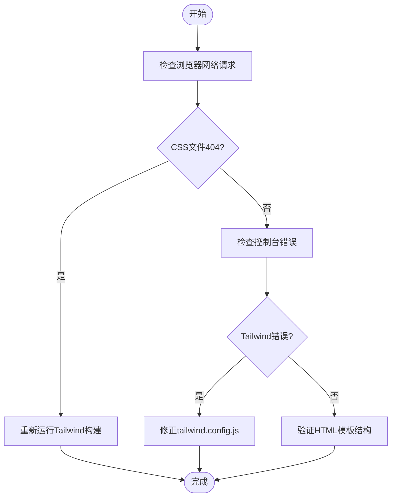
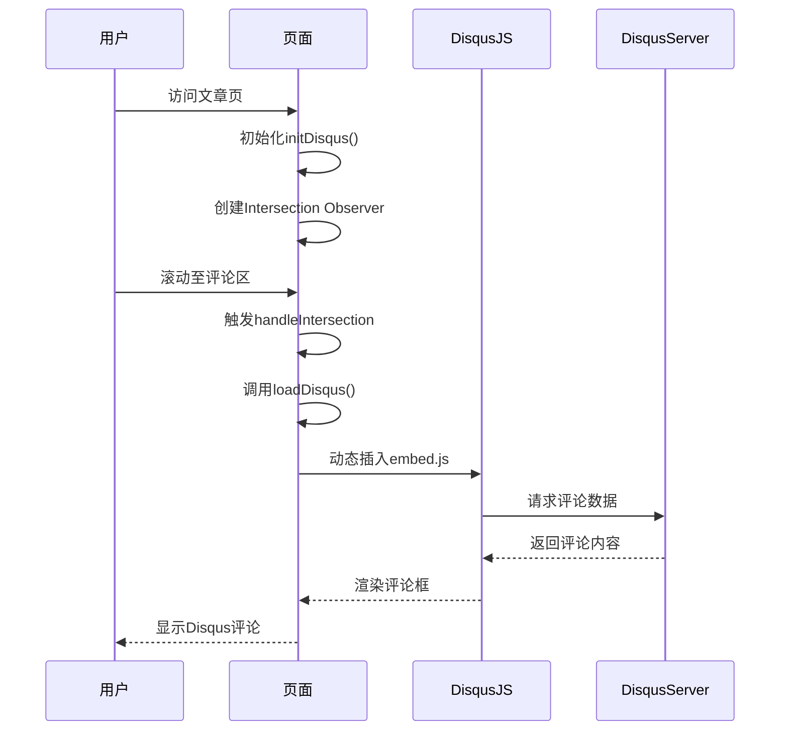

# 故障排查与常见问题

<cite>
**本文档引用文件**
- [hugo.toml](file://hugo.toml)
- [theme.toml](file://themes/void/theme.toml)
- [disqus-lazy.js](file://themes/void/assets/js/disqus-lazy.js)
- [disqus_lazy.html](file://themes/void/layouts/partials/disqus_lazy.html)
- [main.css](file://themes/void/assets/css/main.css)
- [css.html](file://themes/void/layouts/partials/head/css.html)
- [js.html](file://themes/void/layouts/partials/head/js.html)
- [package.json](file://package.json)
- [tailwind.config.js](file://themes/void/tailwind.config.js)
</cite>

## 目录
1. [Hugo服务器无法启动](#hugo服务器无法启动)
2. [页面样式丢失](#页面样式丢失)
3. [Disqus评论不显示](#disqus评论不显示)
4. [访问统计计数异常](#访问统计计数异常)
5. [TOML配置注意事项](#toml配置注意事项)
6. [推荐调试命令与工具](#推荐调试命令与工具)

## Hugo服务器无法启动

### 诊断步骤
1. 检查终端输出日志，确认错误类型（如端口占用、依赖缺失、配置语法错误）
2. 验证 `hugo` 命令是否已正确安装：执行 `hugo version`
3. 确认项目根目录存在 `hugo.toml` 配置文件且格式合法
4. 检查主题路径是否存在且名称匹配配置中的 `theme` 字段

### 修复方法
- 若提示端口被占用，使用 `hugo server --port=1314` 更改端口
- 若提示主题缺失，确认 `themes/void` 目录完整，或重新克隆主题仓库
- 若为依赖缺失，运行 `npm install` 安装 Node.js 依赖
- 若为权限问题，尝试以管理员权限运行或检查文件读写权限

### 预防建议
- 使用版本控制管理主题更新
- 在部署脚本中加入 `hugo -D` 预构建检查
- 定期清理缓存目录 `.hugo_cache`

**Section sources**
- [hugo.toml](file://hugo.toml#L1-L28)
- [theme.toml](file://themes/void/theme.toml#L1-L28)

## 页面样式丢失

### 诊断步骤
1. 打开浏览器开发者工具，查看网络面板中 CSS 文件加载状态
2. 检查是否返回 404 错误，定位具体缺失资源
3. 查看控制台是否有 Tailwind 或构建相关报错
4. 确认 `public/css/` 目录下是否存在生成的样式文件

### 修复方法
- 运行 `cd themes/void && npm run build` 重新生成 Tailwind 样式
- 确保 `tailwind.config.js` 中的 `content` 路径包含所有 HTML 模板
- 清除 Hugo 缓存：删除 `.hugo_cache` 和 `resources` 目录后重建
- 检查 `layouts/partials/head/css.html` 是否正确引入了样式资源

### 预防建议
- 提交前确保本地能正常生成 `style.css`
- 将 `npm run build` 加入 CI/CD 流程
- 避免手动修改 `public/` 目录内容



**Diagram sources**
- [css.html](file://themes/void/layouts/partials/head/css.html#L1-L44)
- [tailwind.config.js](file://themes/void/tailwind.config.js#L1-L40)
- [main.css](file://themes/void/assets/css/main.css#L1-L183)

**Section sources**
- [css.html](file://themes/void/layouts/partials/head/css.html#L1-L44)
- [tailwind.config.js](file://themes/void/tailwind.config.js#L1-L40)

## Disqus评论不显示

### 诊断步骤
1. 检查 `hugo.toml` 中是否配置了 `services.disqus.shortname`
2. 打开浏览器开发者工具，查看 JavaScript 控制台是否有错误
3. 检查网络请求中是否成功加载 `disqus.com/embed.js`
4. 确认页面底部“加载评论”按钮是否可见

### 修复方法
- 在 `hugo.toml` 中添加 Disqus 配置：
  ```toml
  [services]
    [services.disqus]
      shortname = "your-disqus-shortname"
  ```
- 确保 `disqus-lazy.js` 正确注入全局变量 `DISQUS_SHORTNAME`
- 检查 `disqus_lazy.html` 模板是否被正确包含在单页布局中
- 清除浏览器缓存并刷新页面测试

### 预防建议
- 使用环境变量区分开发与生产配置
- 定期测试评论功能是否仍可加载
- 备份原始 Disqus 配置以防误删



**Diagram sources**
- [disqus-lazy.js](file://themes/void/assets/js/disqus-lazy.js#L1-L53)
- [disqus_lazy.html](file://themes/void/layouts/partials/disqus_lazy.html#L1-L37)

**Section sources**
- [disqus-lazy.js](file://themes/void/assets/js/disqus-lazy.js#L1-L53)
- [disqus_lazy.html](file://themes/void/layouts/partials/disqus_lazy.html#L1-L37)

## 访问统计计数异常

### 诊断步骤
1. 检查是否集成了第三方统计服务（如 Google Analytics、Umami）
2. 查看浏览器控制台是否存在跟踪脚本加载失败
3. 确认统计 ID 配置正确且未过期
4. 检查是否因广告拦截插件导致脚本被屏蔽

### 修复方法
- 若使用自定义统计，检查 `layouts/partials/footer.html` 是否嵌入正确脚本
- 替换失效的统计服务链接或更新 API 密钥
- 添加 `<script async>` 异步加载以避免阻塞渲染
- 使用本地日志分析替代方案（如 GoAccess）

### 预防建议
- 优先选择隐私友好型统计工具
- 定期验证统计代码有效性
- 在多设备上交叉验证数据一致性

**Section sources**
- [js.html](file://themes/void/layouts/partials/head/js.html#L1-L148)

## TOML配置注意事项

### 缩进敏感性
- TOML 文件使用空格缩进，禁止使用 Tab 字符
- 嵌套结构需保持层级对齐，例如 `[params.avatar]` 应与上级同级
- 错误示例：
  ```toml
  [params]
  	avatar.url = "..."  # 使用Tab，错误
  ```
- 正确示例：
  ```toml
  [params]
    [params.avatar]
      url = "https://avatars.githubusercontent.com/u/234100657?v=4"
  ```

### 字符串引号要求
- 所有字符串值建议使用双引号包裹
- 特殊字符（如 URL 中的 `:`）必须加引号
- 布尔值和数字无需引号

### 验证工具
- 使用在线 TOML 验证器（如 toml.io）校验语法
- 在提交前运行 `hugo config` 输出解析后的配置

**Section sources**
- [hugo.toml](file://hugo.toml#L1-L28)

## 推荐调试命令与工具

### 调试命令
- `hugo --verbose`：输出详细构建日志，便于定位错误
- `hugo serve --disableFastRender`：禁用快速渲染，确保每次变更都重新构建
- `hugo env`：查看当前环境信息与版本
- `hugo list all`：列出所有内容文件及其元数据

### 浏览器开发者工具技巧
- **Elements 面板**：检查 HTML 结构与类名是否符合预期
- **Console 面板**：查看 JavaScript 错误与警告
- **Network 面板**：过滤 `css`、`js` 请求，确认资源加载状态
- **Sources 面板**：设置断点调试 `disqus-lazy.js` 等关键脚本
- **Application 面板**：查看本地存储与 Cookie 状态

### 其他推荐工具
- **Live Server**：配合 VS Code 实现热重载预览
- **Prettier + TOML 插件**：自动格式化配置文件
- **Git Diff Tool**：对比配置变更前后差异

**Section sources**
- [hugo.toml](file://hugo.toml#L1-L28)
- [package.json](file://package.json#L1-L7)
- [js.html](file://themes/void/layouts/partials/head/js.html#L1-L148)