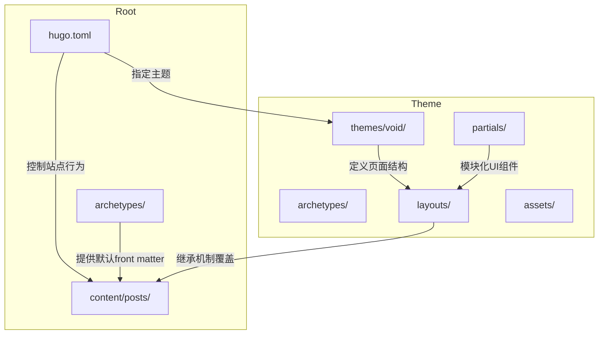
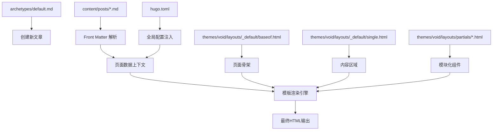

# 目录结构详解

<cite>
**本文档中引用的文件**
- [archetypes/default.md](file://archetypes/default.md)
- [content/posts/my-first-post.md](file://content/posts/my-first-post.md)
- [hugo.toml](file://hugo.toml)
- [themes/void/archetypes/default.md](file://themes/void/archetypes/default.md)
- [themes/void/theme.toml](file://themes/void/theme.toml)
- [themes/void/layouts/_default/baseof.html](file://themes/void/layouts/_default/baseof.html)
- [themes/void/layouts/_default/single.html](file://themes/void/layouts/_default/single.html)
- [themes/void/layouts/partials/header.html](file://themes/void/layouts/partials/header.html)
- [themes/void/layouts/partials/menu.html](file://themes/void/layouts/partials/menu.html)
- [themes/void/layouts/partials/head.html](file://themes/void/layouts/partials/head.html)
- [themes/void/layouts/partials/head/css.html](file://themes/void/layouts/partials/head/css.html)
- [themes/void/layouts/partials/head/js.html](file://themes/void/layouts/partials/head/js.html)
- [themes/void/layouts/partials/footer.html](file://themes/void/layouts/partials/footer.html)
- [themes/void/layouts/partials/terms.html](file://themes/void/layouts/partials/terms.html)
- [themes/void/layouts/partials/disqus_lazy.html](file://themes/void/layouts/partials/disqus_lazy.html)
</cite>

## 目录结构

本项目采用典型的 Hugo 静态网站生成器目录结构，通过分层设计实现内容、配置与主题的清晰分离。根目录包含站点级配置和内容入口，`content/posts/` 存放文章内容，`archetypes/` 定义新内容模板，而 `themes/void/` 则封装了完整的前端展示逻辑与布局组件。

**Diagram sources**
- [hugo.toml](file://hugo.toml#L1-L27)
- [archetypes/default.md](file://archetypes/default.md#L1-L5)
- [content/posts/my-first-post.md](file://content/posts/my-first-post.md#L1-L9)
- [themes/void/theme.toml](file://themes/void/theme.toml#L1-L27)

**Section sources**
- [hugo.toml](file://hugo.toml#L1-L27)
- [archetypes/default.md](file://archetypes/default.md#L1-L5)
- [content/posts/my-first-post.md](file://content/posts/my-first-post.md#L1-L9)

## 核心组件

### archetypes/default.md：新文章模板定义

`archetypes/default.md` 文件用于定义所有新创建文章的默认 front matter 结构。当使用 `hugo new posts/my-post.md` 命令时，Hugo 会自动填充此模板中的元数据字段。当前项目的自定义模板设置了日期、草稿状态和标题格式，其中标题通过 `.File.ContentBaseName` 自动将文件名中的连字符转换为空格并首字母大写。

**Section sources**
- [archetypes/default.md](file://archetypes/default.md#L1-L5)

### content/posts/my-first-post.md：Markdown内容组织方式

`content/posts/` 目录下的 Markdown 文件遵循 Hugo 的内容组织规范。每个文件以 `+++` 包围的 TOML 格式 front matter 开头，声明文章的元信息（如标题、日期、草稿状态）。文件主体为标准 Markdown 语法，支持加粗、斜体、链接等富文本格式。该目录结构允许按年份或类别进一步细分子目录，便于大规模内容管理。

**Section sources**
- [content/posts/my-first-post.md](file://content/posts/my-first-post.md#L1-L9)

### themes/void/ 主题目录组成逻辑

`themes/void/` 是一个功能完整的 Hugo 主题，其内部结构体现了现代静态网站的主题设计模式：

- **archetypes/**：主题自带的默认内容模板，可被站点根目录的同名文件覆盖。
- **assets/**：原始 CSS 和 JavaScript 源码，支持 Tailwind CSS 构建流程。
- **i18n/**：多语言翻译文件（en.toml, zh.toml），支持国际化内容。
- **layouts/**：核心 HTML 模板，包括基础布局、单页、列表页及部分模板（partials）。
- **static/**：静态资源（如图标、favicon），直接复制到输出目录。
- **theme.toml**：主题元数据描述文件，包含名称、许可证、特性标签等。

该主题利用 Hugo 的 partial 系统将页眉、页脚、菜单等 UI 组件模块化，提升可维护性。

**Section sources**
- [themes/void/theme.toml](file://themes/void/theme.toml#L1-L27)
- [themes/void/layouts/_default/baseof.html](file://themes/void/layouts/_default/baseof.html#L1-L23)
- [themes/void/layouts/partials/header.html](file://themes/void/layouts/partials/header.html#L1-L7)
- [themes/void/layouts/partials/menu.html](file://themes/void/layouts/partials/menu.html#L1-L52)

### hugo.toml：根配置文件控制范围

`hugo.toml` 是站点的主配置文件，决定了整个网站的行为特征。它定义了基础 URL、语言代码、站点标题以及所使用的主题（`theme = "void"`）。此外，配置文件还设置了缓存策略，并通过 `[params]` 区块定制主题参数（如头像 URL）。`[[menus.main]]` 数组用于构建主导航菜单，指定菜单项名称、链接目标和排序权重。该文件是站点与主题之间的桥梁，允许在不修改主题源码的情况下进行个性化定制。

**Section sources**
- [hugo.toml](file://hugo.toml#L1-L27)

## 数据流动关系分析

Hugo 的渲染过程涉及多层级的数据流动与优先级覆盖机制。从 `archetypes/default.md` 提供初始模板，到 `content/posts/` 中的实际内容填充，再到 `hugo.toml` 的全局配置注入，最终由 `themes/void/layouts/` 中的模板引擎组合输出 HTML 页面。例如，在渲染单篇文章时，`single.html` 模板继承 `baseof.html` 的整体结构，并通过 `{{ block "main" . }}` 插入具体内容区域。同时，`partials/head.html` 动态生成 `<head>` 内容，整合来自站点配置、主题设置和页面元数据的信息。

**Diagram sources**
- [archetypes/default.md](file://archetypes/default.md#L1-L5)
- [content/posts/my-first-post.md](file://content/posts/my-first-post.md#L1-L9)
- [hugo.toml](file://hugo.toml#L1-L27)
- [themes/void/layouts/_default/baseof.html](file://themes/void/layouts/_default/baseof.html#L1-L23)
- [themes/void/layouts/_default/single.html](file://themes/void/layouts/_default/single.html#L1-L81)

**Section sources**
- [archetypes/default.md](file://archetypes/default.md#L1-L5)
- [content/posts/my-first-post.md](file://content/posts/my-first-post.md#L1-L9)
- [hugo.toml](file://hugo.toml#L1-L27)

## 主题继承机制

Hugo 的主题继承机制允许开发者在不修改原主题的前提下进行深度定制。当站点根目录存在与主题目录同名的文件时（如 `archetypes/default.md` 覆盖 `themes/void/archetypes/default.md`），Hugo 会优先使用站点级别的文件。这种覆盖机制适用于 layouts、static、assets 等所有主题组件。例如，若需修改页脚样式，只需在站点根目录创建 `layouts/partials/footer.html`，即可替换主题自带的版本，同时保留其他未修改的部分。这一机制确保了主题升级时的兼容性，使自定义与原主题解耦。

**Section sources**
- [archetypes/default.md](file://archetypes/default.md#L1-L5)
- [themes/void/archetypes/default.md](file://themes/void/archetypes/default.md#L1-L5)

## 导航地图

为帮助开发者快速定位功能模块，以下是关键路径导航指南：

- **站点配置**：`hugo.toml`
- **内容模板**：`archetypes/default.md`
- **文章内容**：`content/posts/*.md`
- **主题配置**：`themes/void/theme.toml`
- **页面布局**：`themes/void/layouts/_default/`
- **UI组件**：`themes/void/layouts/partials/`
- **样式表**：`themes/void/assets/css/`
- **JavaScript**：`themes/void/assets/js/`

通过此结构，开发者可迅速理解各部分职责并进行针对性修改。

**Section sources**
- [hugo.toml](file://hugo.toml#L1-L27)
- [archetypes/default.md](file://archetypes/default.md#L1-L5)
- [content/posts/my-first-post.md](file://content/posts/my-first-post.md#L1-L9)
- [themes/void/theme.toml](file://themes/void/theme.toml#L1-L27)

## 总结

本项目通过清晰的目录划分实现了内容与表现的分离。`archetypes/` 和 `content/posts/` 共同管理内容创作流程，`hugo.toml` 统一控制站点行为，而 `themes/void/` 则提供了现代化的响应式前端框架。Hugo 的主题继承机制使得个性化定制既灵活又安全，开发者可通过覆盖特定文件来调整外观与功能，而不影响主题的整体稳定性。这种架构非常适合需要长期维护和技术迭代的个人博客或文档站点。