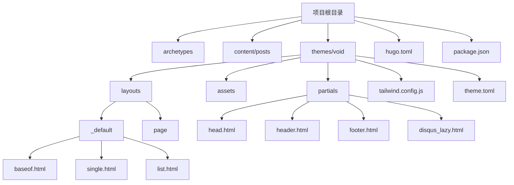
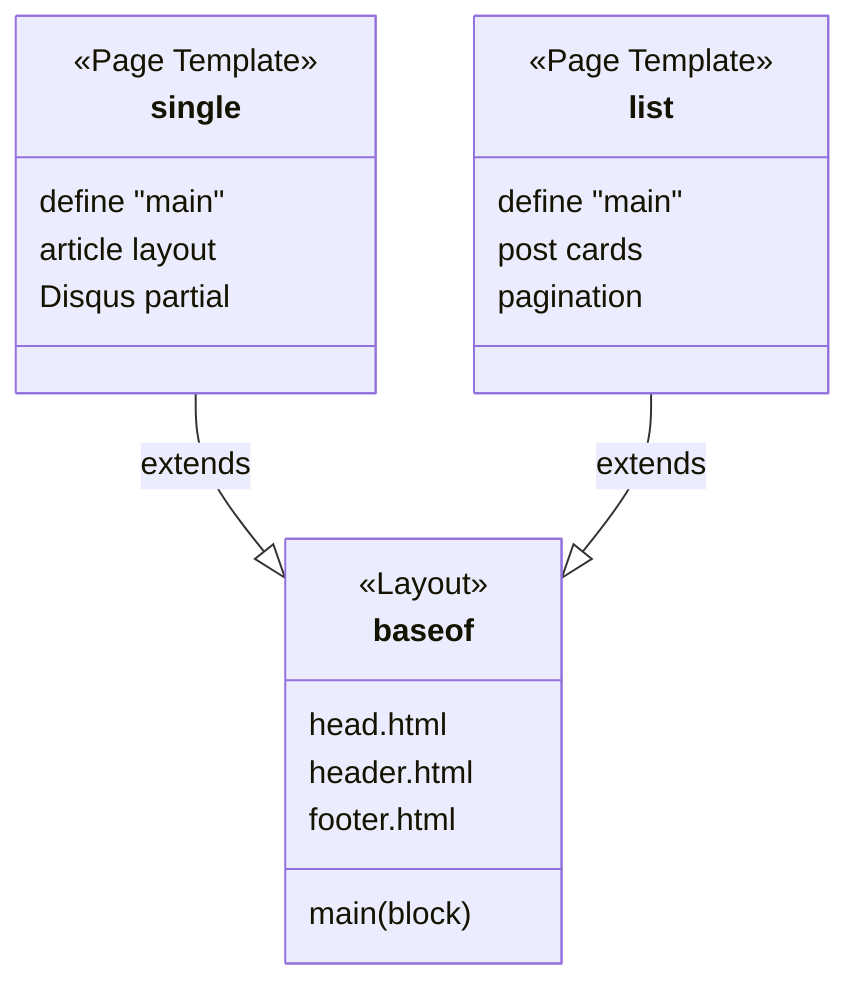
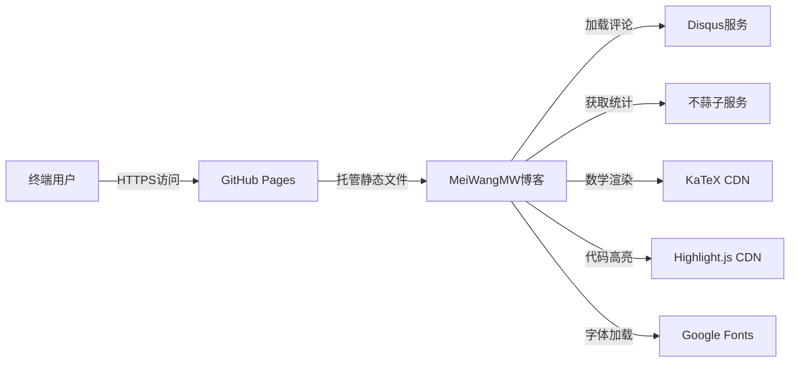

# 项目概述

<cite>
**本文档引用文件**  
- [hugo.toml](file://hugo.toml)
- [themes/void/theme.toml](file://themes/void/theme.toml)
- [themes/void/package.json](file://themes/void/package.json)
- [themes/void/tailwind.config.js](file://themes/void/tailwind.config.js)
- [themes/void/layouts/partials/disqus_lazy.html](file://themes/void/layouts/partials/disqus_lazy.html)
- [themes/void/layouts/partials/head/css.html](file://themes/void/layouts/partials/head/css.html)
- [themes/void/layouts/partials/head/js.html](file://themes/void/layouts/partials/head/js.html)
- [themes/void/layouts/partials/head.html](file://themes/void/layouts/partials/head.html)
- [themes/void/layouts/_default/baseof.html](file://themes/void/layouts/_default/baseof.html)
- [themes/void/layouts/_default/single.html](file://themes/void/layouts/_default/single.html)
- [themes/void/layouts/_default/list.html](file://themes/void/layouts/_default/list.html)
- [themes/void/layouts/partials/header.html](file://themes/void/layouts/partials/header.html)
- [themes/void/layouts/partials/menu.html](file://themes/void/layouts/partials/menu.html)
- [themes/void/layouts/partials/footer.html](file://themes/void/layouts/partials/footer.html)
- [themes/void/layouts/partials/terms.html](file://themes/void/layouts/partials/terms.html)
</cite>

## 目录
1. [简介](#简介)
2. [项目结构](#项目结构)
3. [核心目标与用途](#核心目标与用途)
4. [技术选型分析](#技术选型分析)
5. [架构风格与设计模式](#架构风格与设计模式)
6. [关键依赖详解](#关键依赖详解)
7. [系统边界与集成点](#系统边界与集成点)
8. [可维护性与扩展性机制](#可维护性与扩展性机制)
9. [主题选择与性能优化权衡](#主题选择与性能优化权衡)
10. [结论](#结论)

## 简介
MeiWangMW个人博客项目是一个基于Hugo静态网站生成器构建的现代化个人内容平台，旨在实现高效的内容创作、技术知识分享与个人品牌展示。该项目采用模块化设计理念，结合Tailwind CSS进行响应式前端开发，并集成了Disqus评论系统和不蒜子访问统计功能，形成一个完整的技术博客解决方案。

本项目通过组件化布局与模板继承机制，实现了高度可定制化的页面结构，同时保持代码的清晰与可维护性。其整体架构体现了现代静态站点的最佳实践：轻量、快速、安全且易于部署。

## 项目结构
该项目遵循标准的Hugo项目组织方式，包含内容目录、配置文件、主题子模块等核心组成部分。项目采用分层结构，将内容、逻辑与样式分离，便于独立维护与升级。



**图示来源**
- [hugo.toml](file://hugo.toml)
- [themes/void/theme.toml](file://themes/void/theme.toml)
- [themes/void/layouts/_default/baseof.html](file://themes/void/layouts/_default/baseof.html)
- [themes/void/layouts/_default/single.html](file://themes/void/layouts/_default/single.html)
- [themes/void/layouts/_default/list.html](file://themes/void/layouts/_default/list.html)
- [themes/void/layouts/partials/header.html](file://themes/void/layouts/partials/header.html)
- [themes/void/layouts/partials/footer.html](file://themes/void/layouts/partials/footer.html)

**本节来源**
- [hugo.toml](file://hugo.toml)
- [themes/void/theme.toml](file://themes/void/theme.toml)

## 核心目标与用途
该项目的核心目标是为作者提供一个稳定、美观且高性能的在线内容发布平台，支持长期的知识沉淀与影响力构建。具体用途包括：

- **内容创作**：通过Markdown格式撰写文章，简化写作流程。
- **技术分享**：发布编程经验、学习笔记和技术教程。
- **个人品牌建设**：展示专业能力、研究成果与职业履历（如CV页面）。
- **社区互动**：借助Disqus实现读者评论交流。
- **数据洞察**：利用不蒜子统计访问量，了解内容受欢迎程度。

该博客不仅作为信息输出窗口，也作为作者技术能力的实践体现，展示了对现代Web开发工具链的理解与应用。

**本节来源**
- [hugo.toml](file://hugo.toml)
- [content/posts/my-first-post.md](file://content/posts/my-first-post.md)

## 技术选型分析
项目的技术栈选择充分考虑了开发效率、性能表现与长期可维护性，主要技术组合如下：

| 技术 | 作用 | 优势 |
|------|------|------|
| Hugo | 静态网站生成器 | 极快的构建速度，Go语言编写，无需运行时环境 |
| Tailwind CSS | 实用优先CSS框架 | 按需编译减少体积，高度可定制，提升开发效率 |
| Disqus | 第三方评论系统 | 免运维，支持社交登录，防垃圾评论 |
| 不蒜子 (Busuanzi) | 访问统计服务 | 轻量级，隐私友好，无需用户授权 |

这些技术共同构成了一个低维护成本、高可用性的博客系统，特别适合个人开发者使用。

**本节来源**
- [hugo.toml](file://hugo.toml)
- [themes/void/theme.toml](file://themes/void/theme.toml)
- [themes/void/package.json](file://themes/void/package.json)
- [themes/void/layouts/partials/footer.html](file://themes/void/layouts/partials/footer.html)

## 架构风格与设计模式
项目采用了典型的**组件化+模板继承**架构风格，这是Hugo框架推荐的最佳实践。

### 组件化设计
通过`partials`目录实现UI组件的复用，例如：
- `header.html`：顶部导航栏
- `footer.html`：页脚信息
- `disqus_lazy.html`：懒加载评论组件
- `terms.html`：标签/分类展示组件

每个组件独立封装，可在多个页面中重复使用，降低耦合度。

### 模板继承机制
基于`baseof.html`实现布局继承：
- `_default/baseof.html` 定义全局HTML结构
- `single.html` 和 `list.html` 通过`{{ define "main" }}`注入具体内容
- 所有页面自动继承统一的头部、主体结构与页脚

这种设计确保了视觉一致性，同时允许灵活的内容填充。



**图示来源**
- [themes/void/layouts/_default/baseof.html](file://themes/void/layouts/_default/baseof.html)
- [themes/void/layouts/_default/single.html](file://themes/void/layouts/_default/single.html)
- [themes/void/layouts/_default/list.html](file://themes/void/layouts/_default/list.html)
- [themes/void/layouts/partials/header.html](file://themes/void/layouts/partials/header.html)
- [themes/void/layouts/partials/footer.html](file://themes/void/layouts/partials/footer.html)

**本节来源**
- [themes/void/layouts/_default/baseof.html](file://themes/void/layouts/_default/baseof.html)
- [themes/void/layouts/_default/single.html](file://themes/void/layouts/_default/single.html)
- [themes/void/layouts/_default/list.html](file://themes/void/layouts/_default/list.html)
- [themes/void/layouts/partials/*.html](file://themes/void/layouts/partials/)

## 关键依赖详解
### Hugo 主题：hugo-theme-void
选用[Daucloud/hugo-theme-void](https://github.com/Daucloud/hugo-theme-void)作为基础主题，原因包括：
- 开源MIT许可，自由使用与修改
- 内置Tailwind CSS支持，便于样式定制
- 响应式设计，适配移动端
- 支持多语言（含中文）
- 提供现代化UI组件（卡片、渐变、阴影）

主题通过`theme = "void"`在`hugo.toml`中声明，采用子模块形式集成，便于版本控制与更新。

### Tailwind CSS 按需编译
项目通过`tailwind.config.js`配置内容扫描路径：
```js
content: ["./layouts/**/*.html"]
```
确保仅生成实际使用的CSS类，极大减小最终CSS文件体积。配合`@tailwindcss/cli`构建命令，实现生产环境下的最小化输出。

### JavaScript 功能增强
在`partials/head/js.html`中引入多项增强功能：
- **Alpine.js**：轻量级响应式交互控制
- **KaTeX**：数学公式渲染支持
- **Highlight.js**：代码高亮显示
- **Copy Button**：代码块一键复制功能

所有JS资源通过CDN异步加载，避免阻塞页面渲染。

### 评论系统：Disqus 懒加载
`disqus_lazy.html`实现评论区域的按需加载：
- 初始不加载Disqus脚本
- 用户点击“加载评论”按钮后才发起请求
- 显示加载动画提升用户体验

此举显著减少首屏加载时间，符合性能优化最佳实践。

### 访问统计：不蒜子
在页脚集成不蒜子脚本：
```html
<script async src="//busuanzi.ibruce.info/busuanzi/2.3/busuanzi.pure.mini.js"></script>
```
用于统计：
- 单篇文章阅读量 (`busuanzi_value_page_pv`)
- 站点总访问量 (`busuanzi_value_site_pv`)

该服务无需Cookie或用户追踪，符合隐私保护趋势。

**本节来源**
- [hugo.toml](file://hugo.toml)
- [themes/void/theme.toml](file://themes/void/theme.toml)
- [themes/void/tailwind.config.js](file://themes/void/tailwind.config.js)
- [themes/void/package.json](file://themes/void/package.json)
- [themes/void/layouts/partials/disqus_lazy.html](file://themes/void/layouts/partials/disqus_lazy.html)
- [themes/void/layouts/partials/head/js.html](file://themes/void/layouts/partials/head/js.html)
- [themes/void/layouts/partials/footer.html](file://themes/void/layouts/partials/footer.html)

## 系统边界与集成点
该项目作为一个静态网站，具有清晰的系统边界：



**外部集成点：**
- **Disqus**：第三方评论嵌入
- **不蒜子**：访问计数服务
- **CDN资源**：KaTeX、Highlight.js、Alpine.js、Google Fonts
- **GitHub Pages**：静态托管平台

**内部边界：**
- 内容层（Markdown） ↔ 逻辑层（Hugo模板） ↔ 表现层（Tailwind CSS）
- 主题代码与站点配置分离，便于迁移与复用

**图示来源**
- [themes/void/layouts/partials/disqus_lazy.html](file://themes/void/layouts/partials/disqus_lazy.html)
- [themes/void/layouts/partials/head/js.html](file://themes/void/layouts/partials/head/js.html)
- [themes/void/layouts/partials/head/css.html](file://themes/void/layouts/partials/head/css.html)
- [hugo.toml](file://hugo.toml)

**本节来源**
- [hugo.toml](file://hugo.toml)
- [themes/void/layouts/partials/disqus_lazy.html](file://themes/void/layouts/partials/disqus_lazy.html)
- [themes/void/layouts/partials/head/js.html](file://themes/void/layouts/partials/head/js.html)

## 可维护性与扩展性机制
项目通过以下设计保障长期可维护性与扩展能力：

### 模块化文件结构
- `content/` 存放内容，按类型分类
- `themes/` 独立主题逻辑，可整体替换
- `archetypes/` 定义新文章模板
- 配置集中于`hugo.toml`

### 主题继承与覆盖
Hugo支持在项目根目录创建同名文件覆盖主题默认行为，例如：
- 自定义`layouts/_default/single.html`
- 替换`static/favicon.ico`
- 添加额外CSS/JS

此机制允许在不修改主题源码的前提下进行个性化调整。

### 构建自动化
通过`package.json`中的脚本管理前端资源：
```json
"scripts": {
  "dev": "npx tailwindcss -i ./assets/css/main.css -o ./assets/css/style.css --watch",
  "build": "npx tailwindcss -i ./assets/css/main.css -o ./assets/css/style.css"
}
```
支持开发模式热重载与生产环境构建。

### 多语言支持
主题内置中英文翻译文件：
- `i18n/zh.toml`
- `i18n/en.toml`

可通过Hugo配置切换语言，支持国际化内容发布。

**本节来源**
- [hugo.toml](file://hugo.toml)
- [themes/void/i18n/zh.toml](file://themes/void/i18n/zh.toml)
- [themes/void/i18n/en.toml](file://themes/void/i18n/en.toml)
- [themes/void/package.json](file://themes/void/package.json)
- [archetypes/default.md](file://archetypes/default.md)

## 主题选择与性能优化权衡
### 为何选择 hugo-theme-void？
- **设计美学**：简洁现代，突出内容本身
- **技术先进**：原生支持Tailwind，避免传统CSS臃肿
- **功能完整**：内置评论、统计、代码高亮等常用功能
- **活跃维护**：GitHub上持续更新，社区反馈良好
- **文档完善**：提供详细README与配置说明

相比其他Hugo主题，void在轻量化与功能性之间取得良好平衡。

### Tailwind 按需编译的性能优势
传统CSS框架常导致大量未使用样式被加载。而Tailwind通过静态分析HTML模板，仅生成实际用到的类名，带来显著性能提升：

| 指标 | 传统框架 | Tailwind（按需） |
|------|----------|------------------|
| 初始CSS大小 | ~100KB+ | ~10-20KB |
| 首屏渲染时间 | 较长 | 更短 |
| 可维护性 | 类名语义化差 | 实用类直观易改 |
| 自定义难度 | 需覆盖规则 | 直接调整配置 |

此外，项目还通过以下手段进一步优化性能：
- JS资源异步加载（`defer`）
- 图片懒加载（由Hugo自动处理）
- HTML压缩（Hugo生产构建）
- CDN加速第三方库

这些措施共同确保了即使在网络条件较差的情况下，也能提供流畅的浏览体验。

**本节来源**
- [themes/void/theme.toml](file://themes/void/theme.toml)
- [themes/void/tailwind.config.js](file://themes/void/tailwind.config.js)
- [themes/void/package.json](file://themes/void/package.json)
- [themes/void/layouts/partials/head/css.html](file://themes/void/layouts/partials/head/css.html)
- [themes/void/layouts/partials/head/js.html](file://themes/void/layouts/partials/head/js.html)

## 结论
MeiWangMW个人博客项目是一个结构清晰、技术先进且高度可维护的静态博客实现。它以Hugo为核心引擎，结合hugo-theme-void主题与Tailwind CSS，构建了一个专注于内容表达的现代化发布平台。

项目通过组件化设计提升了代码复用率，利用模板继承保证了界面一致性，并通过懒加载、按需编译等技术手段优化了性能表现。集成Disqus与不蒜子增强了互动性与数据分析能力，而模块化架构则为未来的功能扩展提供了坚实基础。

对于初学者而言，该项目展示了如何使用现代工具链搭建个人博客；对于高级用户，则体现了在技术选型、性能优化与可维护性之间的精妙权衡。整体而言，这是一个兼具实用性与示范价值的技术作品。