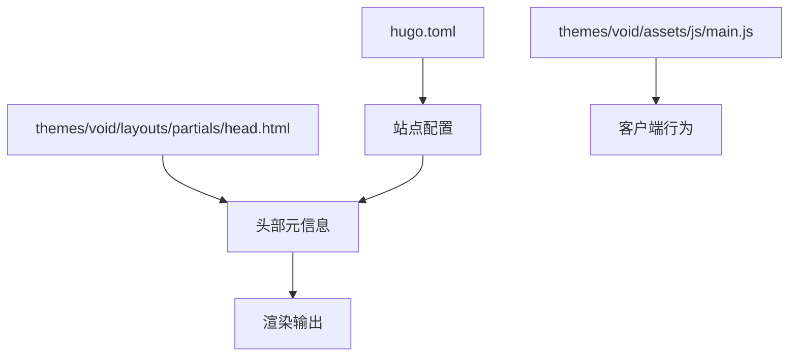
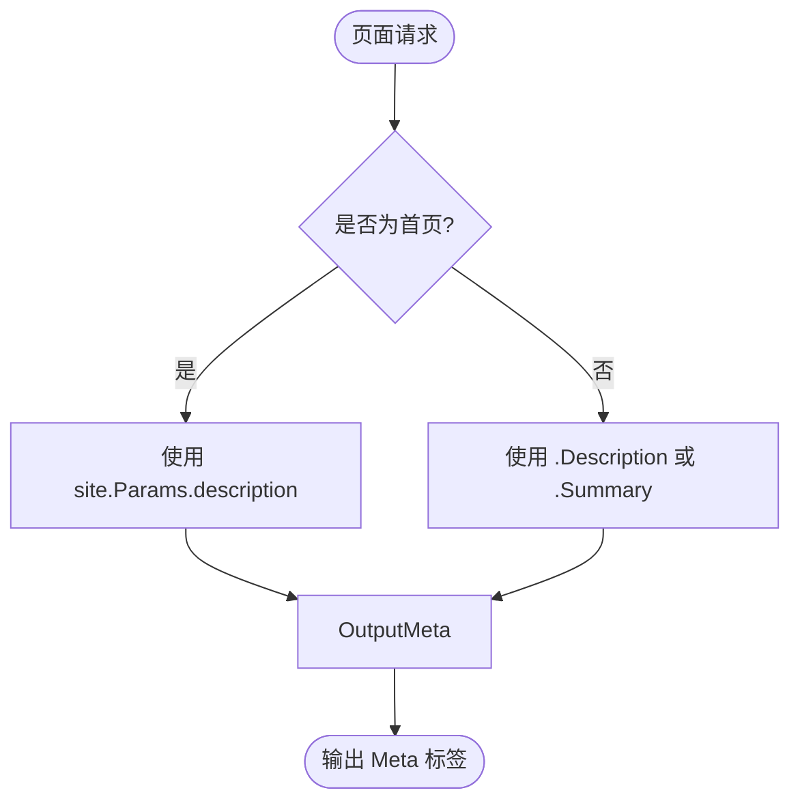

# SEO 优化技巧

<cite>
**本文档引用的文件**
- [hugo.toml](file://hugo.toml)
- [head.html](file://themes/void/layouts/partials/head.html)
- [main.js](file://themes/void/assets/js/main.js)
</cite>

## 目录
1. [简介](#简介)
2. [项目结构概述](#项目结构概述)
3. [核心组件分析](#核心组件分析)
4. [SEO 元标签实现](#seo-元标签实现)
5. [Open Graph 与 Twitter Card 集成](#open-graph-与-twitter-card-集成)
6. [增强型站点地图配置](#增强型站点地图配置)
7. [统一 SEO 配置管理](#统一-seo-配置管理)
8. [性能优化策略](#性能优化策略)
9. [结论](#结论)

## 简介
本文深入讲解如何通过 Hugo 静态站点生成器提升网站在搜索引擎中的可见性。重点涵盖自定义 meta 标签、社交协议（Open Graph 和 Twitter Card）的实现方式，以及如何生成和提交增强型 sitemap.xml 文件以优化搜索引擎抓取效率。同时介绍使用 `.Site.Params.Seo` 统一管理 SEO 配置的最佳实践，并结合异步脚本加载机制提升页面性能。

## 项目结构概述
当前项目采用典型的 Hugo 项目结构，主题位于 `themes/void` 目录下，内容存储于 `content/posts` 路径中。关键的 SEO 相关文件包括根目录下的 `hugo.toml` 配置文件、主题中的 `head.html` 布局模板以及 JavaScript 资源文件。



**图示来源**
- [hugo.toml](file://hugo.toml)
- [head.html](file://themes/void/layouts/partials/head.html)

**本节来源**
- [hugo.toml](file://hugo.toml)
- [head.html](file://themes/void/layouts/partials/head.html)

## 核心组件分析
站点的核心功能由 Hugo 模板系统驱动，其中 `head.html` 是控制页面 `<head>` 区域内容的关键部分。该文件负责注入字符集声明、视口设置、标题生成及外部资源链接。此外，`main.js` 提供了客户端交互支持，可用于延迟加载非关键 SEO 数据。

**本节来源**
- [head.html](file://themes/void/layouts/partials/head.html)
- [main.js](file://themes/void/assets/js/main.js)

## SEO 元标签实现
通过修改 `themes/void/layouts/partials/head.html` 文件，可以添加自定义的 meta 标签来增强搜索引擎对页面的理解能力。建议添加以下标准 meta 字段：

- **description**: 页面内容摘要，直接影响搜索结果片段显示
- **keywords**: 关键词列表（尽管现代搜索引擎权重较低，但仍可作为补充信息）

这些标签应根据页面上下文动态生成，利用 Hugo 的模板变量如 `.Description` 或 `.Summary` 实现个性化描述。



**图示来源**
- [head.html](file://themes/void/layouts/partials/head.html)

**本节来源**
- [head.html](file://themes/void/layouts/partials/head.html)

## Open Graph 与 Twitter Card 集成
为了提升社交媒体分享时的展示效果，需在 `head.html` 中集成 Open Graph 协议和 Twitter Card 支持。具体实现如下：

### Open Graph 协议
添加以下 meta 标签以符合 [Open Graph protocol](https://ogp.me/) 规范：
```html
<meta property="og:title" content="{{ .Title }}" />
<meta property="og:description" content="{{ .Description | default .Summary }}" />
<meta property="og:type" content="article" />
<meta property="og:url" content="{{ .Permalink }}" />
<meta property="og:image" content="{{ .Params.image | absURL }}" />
```

### Twitter Card 支持
为 Twitter 平台优化卡片显示：
```html
<meta name="twitter:card" content="summary_large_image" />
<meta name="twitter:title" content="{{ .Title }}" />
<meta name="twitter:description" content="{{ .Description | default .Summary }}" />
<meta name="twitter:image" content="{{ .Params.image | absURL }}" />
```

图像 URL 应指向高质量、尺寸合适的图片资源，推荐使用绝对路径确保跨平台兼容性。

**本节来源**
- [head.html](file://themes/void/layouts/partials/head.html)

## 增强型站点地图配置
Hugo 内置强大的 sitemap 生成功能，可通过 `hugo.toml` 进行精细化配置。以下是推荐的增强型 sitemap 设置：

```toml
[sitemap]
  changefreq = "weekly"
  filename = "sitemap.xml"
  priority = 0.5

[[menu.main]]
  name = "Sitemap"
  url = "/sitemap.xml"
  weight = 40
```

此配置将 sitemap.xml 文件生成频率设为每周更新一次，并将其加入主菜单便于访问。搜索引擎可通过此文件快速发现新发布或更新的内容页面。

提交 sitemap 至搜索引擎的方法包括：
1. 在 Google Search Console 和 Bing Webmaster Tools 中手动提交
2. 通过 robots.txt 文件声明：`Sitemap: https://meiwangmw.github.io/sitemap.xml`
3. 利用 API 自动推送（如百度主动推送接口）

**本节来源**
- [hugo.toml](file://hugo.toml)

## 统一 SEO 配置管理
建议在 `hugo.toml` 中定义全局 SEO 参数，便于集中管理和维护。例如：

```toml
[params]
  description = "个人技术博客，分享前端开发、静态网站构建与性能优化经验"
  image = "/images/cover.jpg"

  [params.seo]
    twitter_handle = "@meiwangmw"
    og_site_name = "Mei Wang's Blog"
    canonical_url = "https://meiwangmw.github.io"
```

然后在 `head.html` 中通过 `.Site.Params.Seo` 访问这些值，实现配置与模板的解耦，提高可维护性。

**本节来源**
- [hugo.toml](file://hugo.toml)
- [head.html](file://themes/void/layouts/partials/head.html)

## 性能优化策略
为避免额外的 meta 标签影响首屏加载性能，建议采用异步加载策略处理非关键元数据。可在 `main.js` 中实现延迟加载逻辑：

```javascript
// 延迟加载社交元数据
function loadSocialMeta() {
  const ogImage = document.createElement('meta');
  ogImage.setAttribute('property', 'og:image');
  ogImage.content = window.location.origin + '/images/default-og.jpg';
  document.head.appendChild(ogImage);
}

// 页面空闲时加载
if (window.requestIdleCallback) {
  requestIdleCallback(loadSocialMeta);
} else {
  // 降级方案
  setTimeout(loadSocialMeta, 2000);
}
```

这种方式确保核心内容优先渲染，同时不影响 SEO 功能完整性。

**本节来源**
- [main.js](file://themes/void/assets/js/main.js)
- [head.html](file://themes/void/layouts/partials/head.html)

## 结论
通过合理配置 `hugo.toml`、完善 `head.html` 中的元标签体系，并结合异步脚本优化加载性能，可显著提升站点在搜索引擎和社交平台上的表现。建议定期检查 sitemap 更新情况，监控搜索引擎收录状态，持续优化关键词布局与内容质量，从而实现长期稳定的流量增长。