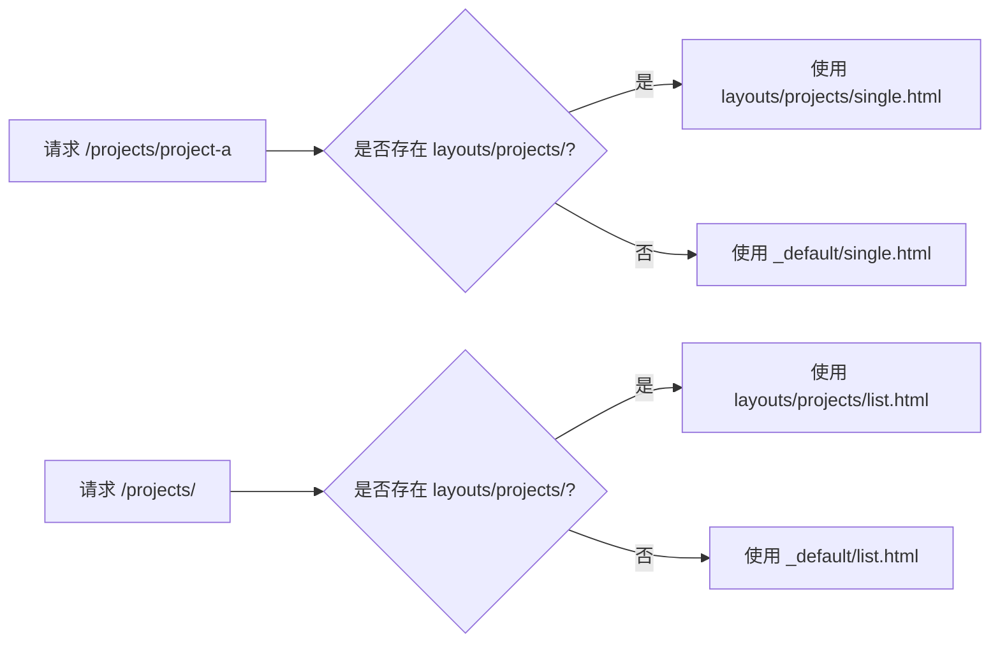
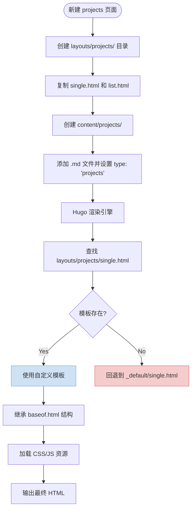

# 添加新页面类型

<cite>
**本文档中引用的文件**
- [baseof.html](file://themes/void/layouts/_default/baseof.html)
- [single.html](file://themes/void/layouts/_default/single.html)
- [list.html](file://themes/void/layouts/_default/list.html)
- [my-first-post.md](file://content/posts/my-first-post.md)
- [about.html](file://themes/void/layouts/page/about.html)
- [head.html](file://themes/void/layouts/partials/head.html)
- [css.html](file://themes/void/layouts/partials/head/css.html)
- [js.html](file://themes/void/layouts/partials/head/js.html)
- [menu.html](file://themes/void/layouts/partials/menu.html)
- [theme.toml](file://themes/void/theme.toml)
- [hugo.toml](file://hugo.toml)
</cite>

## 目录
1. [简介](#简介)
2. [项目结构概览](#项目结构概览)
3. [核心组件分析](#核心组件分析)
4. [架构概述](#架构概述)
5. [详细组件分析](#详细组件分析)
6. [依赖关系分析](#依赖关系分析)
7. [性能考虑](#性能考虑)
8. [故障排除指南](#故障排除指南)
9. [结论](#结论)

## 简介
本文档旨在指导开发者如何为博客系统添加新的独立页面类型（如 projects、talks 或 publications）。通过分析现有代码库结构，说明如何在 `layouts/` 目录下创建对应子目录并定义模板文件，以及如何组织内容文件和配置 front matter 以启用特定布局。文档将结合实际文件路径与功能实现，提供清晰的操作指引。

## 项目结构概览
本项目采用 Hugo 静态站点生成器的标准结构，主题位于 `themes/void/` 目录中，主要内容存储于 `content/posts/`。新增页面类型需遵循既有的模板继承机制和资源加载逻辑。

```mermaid
graph TB
subgraph "内容目录"
content[content/]
posts[posts/]
projects[projects/ (待创建)]
end
subgraph "主题目录"
themes[themes/]
layouts[layouts/]
partials[partials/]
assets[assets/]
end
content --> layouts
layouts --> partials
layouts --> baseof["baseof.html"]
baseof --> head["partial: head.html"]
baseof --> header["partial: header.html"]
baseof --> footer["partial: footer.html"]
head --> css["partial: css.html"]
head --> js["partial: js.html"]
```

**Diagram sources**
- [baseof.html](file://themes/void/layouts/_default/baseof.html)
- [head.html](file://themes/void/layouts/partials/head.html)
- [css.html](file://themes/void/layouts/partials/head/css.html)
- [js.html](file://themes/void/layouts/partials/head/js.html)

**Section sources**
- [baseof.html](file://themes/void/layouts/_default/baseof.html)
- [head.html](file://themes/void/layouts/partials/head.html)

## 核心组件分析
要添加新页面类型，关键在于理解 Hugo 的模板查找规则和布局继承机制。所有页面均继承自 `baseof.html`，并通过 `block "main"` 插入具体内容。不同内容类型的渲染由 `_default/single.html` 和 `_default/list.html` 提供基础支持。

**Section sources**
- [baseof.html](file://themes/void/layouts/_default/baseof.html)
- [single.html](file://themes/void/layouts/_default/single.html)
- [list.html](file://themes/void/layouts/_default/list.html)

## 架构概述
Hugo 使用基于目录结构的模板优先级系统。当访问某一内容类型时，引擎会优先查找 `layouts/<type>/` 下的模板，若不存在则回退至 `_default/` 中的通用模板。这种设计允许高度定制化的同时保持可维护性。



**Diagram sources**
- [single.html](file://themes/void/layouts/_default/single.html)
- [list.html](file://themes/void/layouts/_default/list.html)

## 详细组件分析

### 新建页面类型步骤详解

#### 步骤一：创建布局目录与模板文件
为新类型（如 `projects`）创建专属布局目录，并复制默认模板作为起点：

```bash
mkdir -p themes/void/layouts/projects
cp themes/void/layouts/_default/single.html themes/void/layouts/projects/single.html
cp themes/void/layouts/_default/list.html themes/void/layouts/projects/list.html
```

这些模板将自动继承 `baseof.html` 的整体结构，并可通过修改 `single.html` 和 `list.html` 来定制展示样式。

#### 步骤二：创建内容目录并添加内容
在 `content/` 下创建对应的内容目录：

```bash
mkdir -p content/projects
```

然后创建一个示例内容文件，例如 `content/projects/my-project.md`，其 front matter 应包含 `type: 'projects'` 以确保正确匹配模板：

```markdown
+++
title = "My Project"
date = 2024-01-15T08:00:00+01:00
draft = false
type = "projects"
+++

## Introduction

This is a description of my project.
```

#### 步骤三：验证模板继承与资源加载
新模板自动继承以下结构：
- 页面骨架来自 `baseof.html`
- 头部元信息、CSS 和 JS 资源通过 `partial "head.html"` 加载
- 主体内容插入 `{{ block "main" . }}{{ end }}` 区域

因此无需重复定义 CSS 或 JavaScript 引用，所有资源已通过 `partials/head/css.html` 和 `partials/head/js.html` 统一管理。

```mermaid
classDiagram
class baseof {
+<!DOCTYPE html>
+<html> <head> <body>
+{{ partial "head.html" }}
+{{ block "main" . }}{{ end }}
}
class single {
+{{ define "main" }}
+文章标题、元数据、内容区
+评论模块
}
class list {
+{{ define "main" }}
+列表标题、年份分组
+文章摘要、标签、阅读更多链接
}
single --> baseof : "extends"
list --> baseof : "extends"
```

**Diagram sources**
- [baseof.html](file://themes/void/layouts/_default/baseof.html)
- [single.html](file://themes/void/layouts/_default/single.html)
- [list.html](file://themes/void/layouts/_default/list.html)

**Section sources**
- [baseof.html](file://themes/void/layouts/_default/baseof.html)
- [single.html](file://themes/void/layouts/_default/single.html)
- [list.html](file://themes/void/layouts/_default/list.html)
- [my-first-post.md](file://content/posts/my-first-post.md)

## 依赖关系分析
新页面类型的正常运行依赖于多个核心组件之间的协作：



**Diagram sources**
- [baseof.html](file://themes/void/layouts/_default/baseof.html)
- [single.html](file://themes/void/layouts/_default/single.html)
- [list.html](file://themes/void/layouts/_default/list.html)

**Section sources**
- [baseof.html](file://themes/void/layouts/_default/baseof.html)
- [single.html](file://themes/void/layouts/_default/single.html)
- [list.html](file://themes/void/layouts/_default/list.html)

## 性能考虑
由于新页面类型复用现有 CSS 和 JS 资源，不会引入额外网络请求。代码高亮、数学公式等功能均已通过 `head/js.html` 懒加载处理，确保首屏加载速度不受影响。建议对长列表页启用分页功能（Paginator），避免单页内容过多导致渲染延迟。

## 故障排除指南
常见问题及解决方案：

| 问题现象 | 可能原因 | 解决方法 |
|--------|--------|--------|
| 页面未使用自定义模板 | `type` 字段缺失或拼写错误 | 确保 front matter 中有 `type: 'projects'` |
| 样式丢失 | 模板未正确继承 baseof | 检查是否包含 `{{ define "main" }}` 并被 `baseof` 正确调用 |
| 资源未加载 | partial 调用路径错误 | 确认 `head.html` 被正确包含 |
| 导航菜单不显示 | 菜单项未配置 | 在 `hugo.toml` 中添加菜单项 |

**Section sources**
- [hugo.toml](file://hugo.toml)
- [head.html](file://themes/void/layouts/partials/head.html)
- [menu.html](file://themes/void/layouts/partials/menu.html)

## 结论
通过在 `layouts/` 下创建新类型目录并定义 `single.html` 和 `list.html` 模板，结合 `content/` 中对应目录的内容文件与正确的 `type` 设置，可以轻松扩展博客的功能。整个过程充分利用了 Hugo 的模板继承机制和模块化设计，保证了可维护性和一致性。推荐开发者按照此模式进行功能拓展，以保持项目结构清晰。