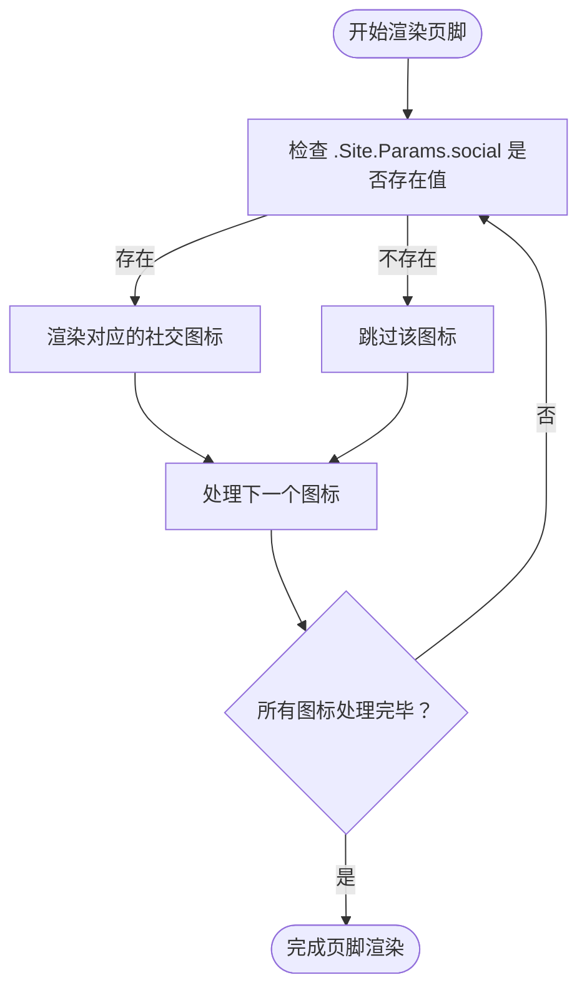

# 自定义 Partial 覆盖主题组件

<cite>
**本文档引用文件**  
- [header.html](file://themes/void/layouts/partials/header.html)
- [menu.html](file://themes/void/layouts/partials/menu.html)
- [footer.html](file://themes/void/layouts/partials/footer.html)
- [baseof.html](file://themes/void/layouts/_default/baseof.html)
- [hugo.toml](file://hugo.toml)
</cite>

## 目录
1. [简介](#简介)
2. [项目结构与 Partial 组件位置](#项目结构与-partial-组件位置)
3. [覆盖机制：Hugo 模板查找优先级](#覆盖机制hugo-模板查找优先级)
4. [实际覆盖示例](#实际覆盖示例)
5. [安全扩展原则](#安全扩展原则)
6. [常见问题排查](#常见问题排查)
7. [总结](#总结)

## 简介
本文详细说明如何通过在 Hugo 项目中创建自定义 `partial` 模板来安全地覆盖主题中的组件，如页眉（header）、菜单（menu）和页脚（footer）。我们将基于当前使用的 `void` 主题进行讲解，并提供具体操作步骤、原理说明及最佳实践建议。

## 项目结构与 Partial 组件位置
Hugo 使用模块化模板系统，其中 `partials` 是可复用的 HTML 片段。在本项目中，主题 `void` 的 partial 文件位于：

```
themes/void/layouts/partials/
├── header.html
├── menu.html
├── footer.html
└── ...
```

这些文件被主布局文件 `baseof.html` 引用以构建页面结构。

```mermaid
graph TD
A[baseof.html] --> B[{{ partial \"header.html\" }}]
A --> C[{{ partial \"footer.html\" }}]
B --> D[{{ partial \"menu.html\" }}]
```

**Diagram sources**
- [baseof.html](file://themes/void/layouts/_default/baseof.html#L8)
- [header.html](file://themes/void/layouts/partials/header.html#L6)

## 覆盖机制：Hugo 模板查找优先级
Hugo 在渲染模板时遵循明确的查找路径优先级规则：

1. **项目根目录**：`layouts/partials/`
2. **当前主题目录**：`themes/<theme-name>/layouts/partials/`

这意味着，只要在项目根目录下创建同名 partial 文件（例如 `layouts/partials/header.html`），Hugo 就会自动优先使用该项目级别的版本，从而实现对主题原始文件的安全覆盖。

此机制确保了：
- 原始主题文件保持不变
- 主题更新后仍可保留自定义修改
- 易于版本控制和团队协作

## 实际覆盖示例

### 示例 1：修改页眉导航栏样式
要更改页眉外观，首先在项目中创建对应路径：

```bash
mkdir -p layouts/partials
cp themes/void/layouts/partials/header.html layouts/partials/
```

然后编辑 `layouts/partials/header.html`，例如将标题颜色改为紫色：

```html
<a href="{{ "/" | relLangURL }}" class="text-current hover:text-purple-600 transition-colors no-underline">
  {{.Site.Title}}
</a>
```

### 示例 2：向主菜单添加新菜单项
当前菜单由 `menu.html` 渲染并接收 `main` 菜单数据。菜单项定义在 `hugo.toml` 中：

```toml
[[menus.main]]
name = 'Home'
pageRef = '/'
weight = 10

[[menus.main]]
name = 'CV'
pageRef = '/cv'
weight = 20

[[menus.main]]
name = 'Research'
pageRef = '/research'
weight = 30
```

若需添加“Blog”链接，只需在 `hugo.toml` 中追加：

```toml
[[menus.main]]
name = 'Blog'
pageRef = '/posts'
weight = 25
```

无需修改任何 partial 文件即可生效。

### 示例 3：自定义页脚内容
复制原始 `footer.html` 到项目目录：

```bash
cp themes/void/layouts/partials/footer.html layouts/partials/
```

可在页脚添加自定义文本或移除不使用的社交图标（如知乎），Hugo 会根据 `.Site.Params.social` 配置自动隐藏未设置的图标。



**Diagram sources**
- [footer.html](file://themes/void/layouts/partials/footer.html#L0-L95)

**Section sources**
- [footer.html](file://themes/void/layouts/partials/footer.html#L0-L95)

## 安全扩展原则
为确保网站长期可维护性和兼容性，请遵守以下原则：

- ✅ **推荐做法**：始终在 `layouts/partials/` 下创建覆盖文件
- ❌ **禁止行为**：直接修改 `themes/void/` 内部文件
- 🔁 **升级保障**：当 `void` 主题更新时，可通过 git submodule 更新而不影响自定义部分
- 📦 **隔离变更**：所有定制化内容集中在项目根目录，便于迁移或审查

此举实现了“主题归主题，定制归项目”的良好分离架构。

## 常见问题排查

### 缓存导致更改未生效
Hugo 可能缓存模板资源，导致新修改的 partial 未及时反映。解决方法是强制忽略缓存重建：

```bash
hugo --ignoreCache --minify
```

或启动服务器时使用：

```bash
hugo server --ignoreCache -D
```

### 新增菜单项不显示
请确认：
- `hugo.toml` 中已正确定义菜单项
- `pageRef` 指向的页面路径存在
- 权重 `weight` 设置合理以控制排序

### 样式未生效
检查浏览器开发者工具中：
- CSS 是否正确加载
- 是否有更高优先级的样式覆盖
- Tailwind 类名拼写是否正确

## 总结
通过利用 Hugo 的模板查找优先级机制，在 `layouts/partials/` 目录下创建同名文件是一种强大且安全的方式来定制主题组件。无论是调整样式、增加功能还是优化布局，都能在不触碰主题核心代码的前提下完成，极大提升了项目的可维护性与灵活性。

**Section sources**
- [header.html](file://themes/void/layouts/partials/header.html#L0-L7)
- [menu.html](file://themes/void/layouts/partials/menu.html#L0-L52)
- [footer.html](file://themes/void/layouts/partials/footer.html#L0-L95)
- [baseof.html](file://themes/void/layouts/_default/baseof.html#L0-L22)
- [hugo.toml](file://hugo.toml#L0-L27)