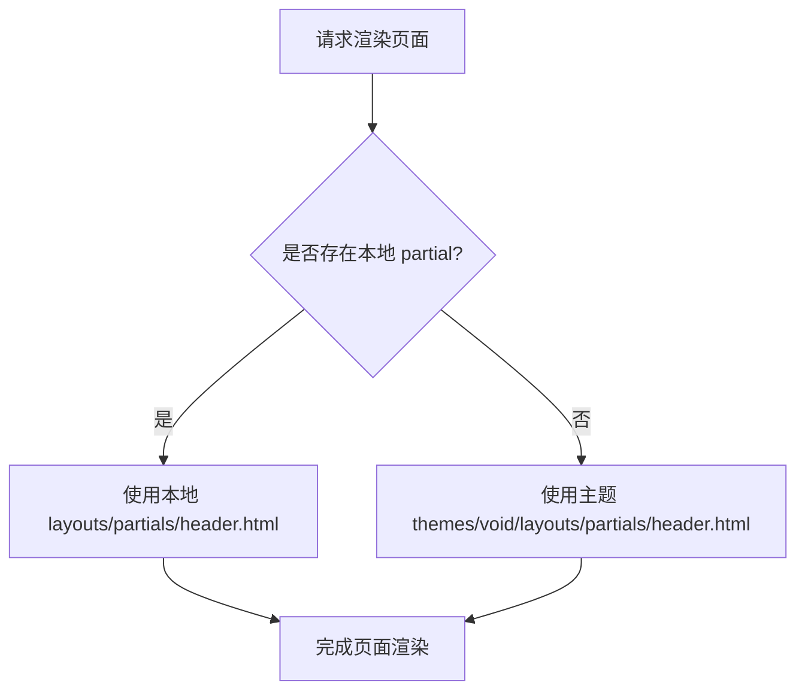
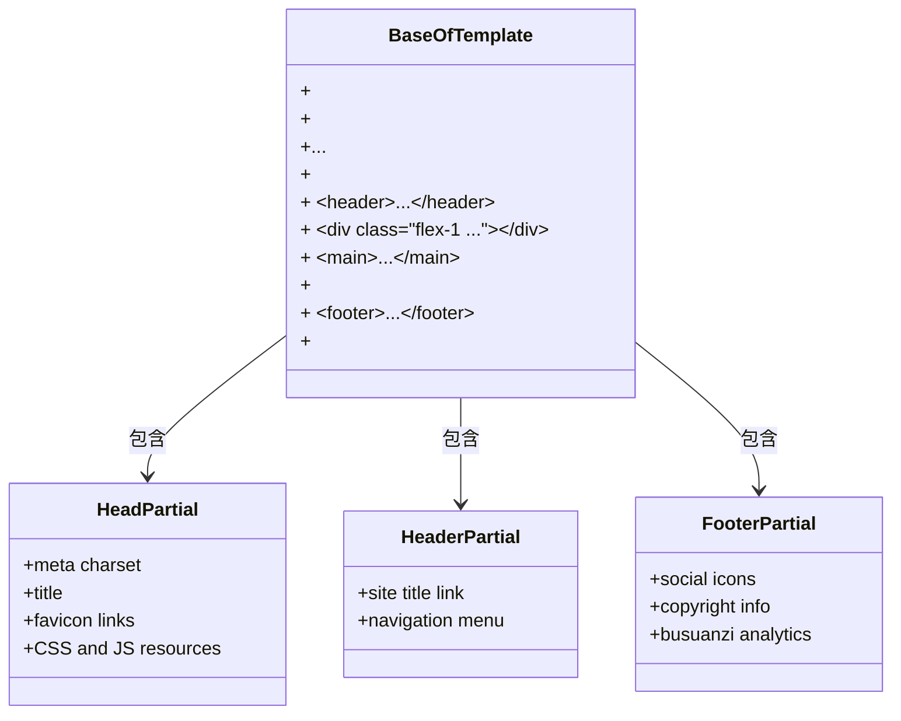
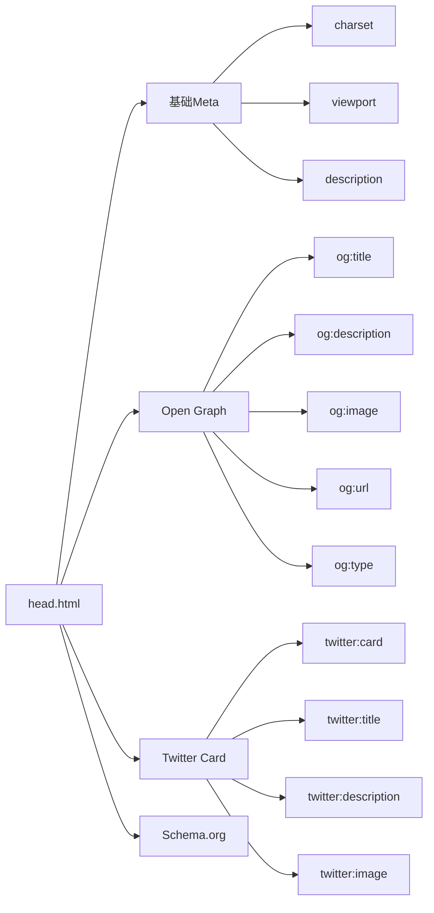

# 高级扩展建议

<cite>
**本文档中引用的文件**
- [header.html](file://themes/void/layouts/partials/header.html)
- [footer.html](file://themes/void/layouts/partials/footer.html)
- [baseof.html](file://themes/void/layouts/_default/baseof.html)
- [head.html](file://themes/void/layouts/partials/head.html)
- [css.html](file://themes/void/layouts/partials/head/css.html)
- [js.html](file://themes/void/layouts/partials/head/js.html)
- [theme.toml](file://themes/void/theme.toml)
- [sitemap.xml](file://public/sitemap.xml)
- [hugo.toml](file://hugo.toml)
</cite>

## 目录
1. [自定义Partial覆盖](#自定义partial覆盖)
2. [baseof.html基础模板详解](#baseofhtml基础模板详解)
3. [添加新页面类型](#添加新页面类型)
4. [SEO优化策略](#seo优化策略)

## 自定义Partial覆盖

Hugo主题系统允许开发者通过在项目根目录的`layouts/partials/`路径下创建同名文件来覆盖主题中的partials，从而实现对原有组件的个性化定制。这种机制遵循"就近优先"原则，站点本地的模板将优先于主题模板被加载。

例如，要自定义页眉布局，可在`layouts/partials/`目录下创建`header.html`文件，其内容结构应与原主题保持兼容：



**Section sources**
- [header.html](file://themes/void/layouts/partials/header.html)
- [baseof.html](file://themes/void/layouts/_default/baseof.html)

## baseof.html基础模板详解

`baseof.html`作为所有页面的基础骨架模板，定义了HTML文档的基本结构和全局元素的布局位置。该模板采用块（block）系统，允许子模板通过定义`main`块来填充主要内容区域。

当前主题的`baseof.html`结构包含三个关键部分：
1. **头部区域**：通过`{{ partial "head.html" . }}`引入元数据和资源链接
2. **主体区域**：固定定位的页眉和弹性布局的主内容区
3. **页脚区域**：包含社交链接和版权信息的页脚

为确保主题升级兼容性，修改时应避免直接更改`baseof.html`文件，而应在站点根目录创建`layouts/_default/baseof.html`进行覆盖，并仅调整必要的结构或样式类。



**Diagram sources**
- [baseof.html](file://themes/void/layouts/_default/baseof.html)
- [head.html](file://themes/void/layouts/partials/head.html)
- [header.html](file://themes/void/layouts/partials/header.html)
- [footer.html](file://themes/void/layouts/partials/footer.html)

**Section sources**
- [baseof.html](file://themes/void/layouts/_default/baseof.html)

## 添加新页面类型

要为网站添加新的页面类型（如projects或talks），需遵循以下步骤：

1. 在站点根目录创建`layouts`文件夹（若不存在）
2. 在`layouts`下新建对应类型的目录，如`layouts/projects/`
3. 在该目录中定义相应的模板文件，如`single.html`用于单个项目展示，`list.html`用于项目列表

新页面类型的URL路由将自动映射到`/projects/`路径。同时，需要在内容目录下创建对应的子目录`content/projects/`并添加Markdown文件。

此外，可通过修改`hugo.toml`配置文件中的菜单设置，将新页面类型添加到导航栏：

```toml
[[menus.main]]
name = 'Projects'
pageRef = '/projects'
weight = 40
```

**Section sources**
- [hugo.toml](file://hugo.toml)

## SEO优化策略

### Meta标签定制

通过覆盖`layouts/partials/head.html`，可以增强meta标签的SEO功能。当前主题已包含基本的viewport和title设置，建议扩展以下标签：



### Sitemap增强

当前生成的`sitemap.xml`包含基本的URL和最后修改时间信息。可通过创建自定义sitemap模板`layouts/sitemap.xml`来添加priority和changefreq属性：

```xml
<url>
  <loc>http://localhost:1313/</loc>
  <lastmod>2024-01-14T07:07:07+01:00</lastmod>
  <changefreq>weekly</changefreq>
  <priority>1.0</priority>
</url>
```

### Open Graph协议支持

为提升社交媒体分享效果，建议在`head.html`中添加动态Open Graph标签：

```html
<meta property="og:title" content="{{ .Title }}">
<meta property="og:description" content="{{ .Description | default (.Summary | truncate 150) }}">
<meta property="og:image" content="{{ .Params.image | absURL | default (.Site.Params.imageshare | absURL) }}">
<meta property="og:url" content="{{ .Permalink }}">
<meta property="og:type" content="{{ if .IsHome }}website{{ else }}article{{ end }}">
```

**Diagram sources**
- [head.html](file://themes/void/layouts/partials/head.html)
- [sitemap.xml](file://public/sitemap.xml)

**Section sources**
- [head.html](file://themes/void/layouts/partials/head.html)
- [sitemap.xml](file://public/sitemap.xml)
- [hugo.toml](file://hugo.toml)